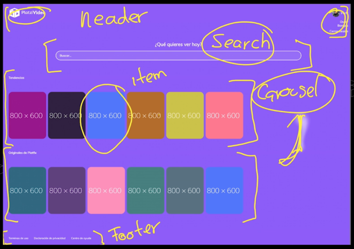
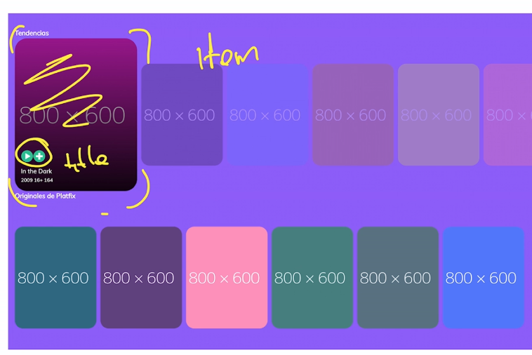
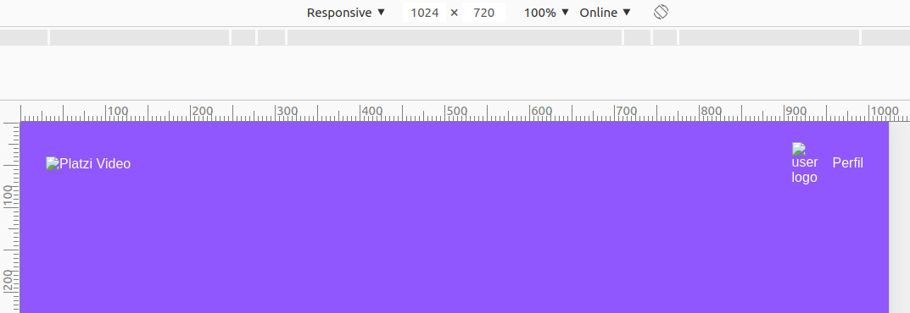
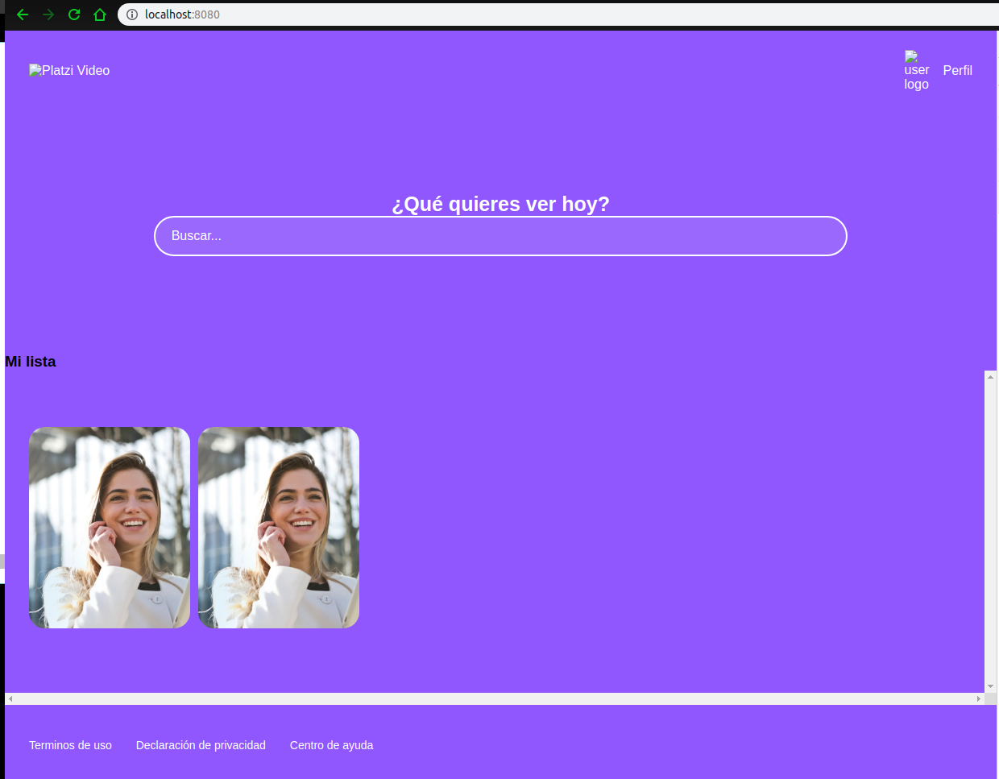

# Curso Práctico de React JS

## **_Escuela de JavaScript - Platzi 2019_**

---

---

Visiten esta página de la que no soy el autor pero cumple el mismo objetivo hasta la instalación y configuración manual, pero con mayor detalle en explicación: _**[Curso Práctico de React JS by augdiaugus](https://augdiaugus.gitbook.io/recoleccion-de-notas-publicas/escuela-de-javascript/curso-practico-de-react-js)**_ Este blog usa en gran manera la [documentación de React en español](https://es.reactjs.org/docs/getting-started.html), solo colocaré la info mínima requerida para una consulta rápida de configuración y estado del arte.

---

---

## React


[Documentación de React.js en español](https://es.reactjs.org/)

**React** \(también llamada **React.js** o ReactJS\) es una biblioteca Javascript de código abierto diseñada para crear [interfaces de usuario](https://es.wikipedia.org/wiki/Interfaz_de_usuario) con el objetivo de facilitar el desarrollo de [aplicaciones en una sola página](https://es.wikipedia.org/wiki/Single-page_application). Es mantenido por [Facebook](https://es.wikipedia.org/wiki/Facebook) y la comunidad de [software libre](https://es.wikipedia.org/wiki/Software_libre), han participado en el proyecto más de mil desarrolladores diferentes [1](https://es.wikipedia.org/wiki/React#cite_note-infoworld-1)​.

Cada pequeña parte de nuestra página web la conoceremos como "Componente". Cada componente se encargará de una función en específico. Además, podremos reutilizar nuestros componentes siempre que lo necesitemos. Al unir todos nuestros componentes tendremos una página web que nos permite cambiar, actualizar o eliminar elementos de forma muy sencilla.

React intenta ayudar a los desarrolladores a construir aplicaciones que usan datos que cambien todo el tiempo. Su objetivo es ser sencillo, declarativo y fácil de combinar. React sólo maneja la [interfaz de usuario](https://es.wikipedia.org/wiki/Interfaz_de_usuario) en una aplicación; React es la **Vista** en un contexto en el que se use el patrón [MVC](https://es.wikipedia.org/wiki/Modelo%E2%80%93vista%E2%80%93controlador) (Modelo-Vista-Controlador) o [MVVM](https://es.wikipedia.org/wiki/Modelo%E2%80%93vista%E2%80%93modelo_de_vista) (Modelo-vista-modelo de vista). También puede ser utilizado con las extensiones de React-based que se encargan de las partes no-UI (que no forman parte de la interfaz de usuario) de una [aplicación web](https://es.wikipedia.org/wiki/Aplicaci%C3%B3n_web).

Según el servicio de análisis Javascript (en inglés "javascript analytics service"), Libscore, React actualmente está siendo utilizado en las páginas principales de Imgur, Bleacher Informe, [Feedly](https://es.wikipedia.org/wiki/Feedly), [Airbnb](https://es.wikipedia.org/wiki/Airbnb), SeatGeek, HelloSign, y otras.[2](https://es.wikipedia.org/wiki/React#cite_note-2)​

### Historia

React fue creada por Jordan Walke y publicada en mayo de 2013, un ingeniero de software en Facebook, inspirado por los problemas que tenía la compañía con el mantenimiento del código de los anuncios dentro de su plataforma. Enfocado en la experiencia del usuario y la eficiencia para sus programadores, influenciado por XHP (un marco de componentes de [HTML](https://es.wikipedia.org/wiki/HTML) para [PHP](https://es.wikipedia.org/wiki/PHP)), nace el prototipo ReactJS.

---

## DOM, Virtual DOM y React DOM

El DOM es el código HTML que se transforma en páginas web.

Cada vez que cambiamos alguna parte del DOM, también estamos actualizando el HTML con el que interactúan nuestros usuarios. El problema es que todas las operaciones, comparaciones y actualizaciones en el DOM son muy costosas.

El Virtual DOM es una herramienta que usan tecnologías como React y Vue para mejorar el rendimiento (_performance_) y velocidad de nuestras aplicaciones.

Es una copia exacta del DOM, pero mucho más ligera, ya que los cambios no actualizan el verdadero HTML de nuestras páginas web. Gracias al Virtual DOM podemos hacer operaciones y comparaciones de forma sumamente rápida.

Recuerda que los cambios en el Virtual DOM no afectan el HTML que ven los usuarios, así que debemos estar sincronizando constantemente las copias con el DOM. Pero no te preocupes, React DOM lo hace por nosotros.

### Qué es el DOM virtual

El DOM virtual (_VDOM_) es un concepto de programación donde una representación ideal o "virtual" de la IU se mantiene en memoria y en sincronía con el DOM "real", mediante una biblioteca como ReactDOM. Este proceso se conoce como [reconciliación](https://es.reactjs.org/docs/reconciliation.html).

Este enfoque hace posible la API declarativa de React: le dices a React en qué estado quieres que esté la IU, y se hará cargo de llevar el DOM a ese estado. Esto abstrae la manipulación de atributos, manejo de eventos y actualización manual del DOM que de otra manera tendrías que usar para construir tu aplicación.

Ya que "DOM virtual" es más un patrón que una tecnología específica, las personas a veces le dan significados diferentes. En el mundo de React, el término "DOM virtual" es normalmente asociado con [elementos de React](https://es.reactjs.org/docs/rendering-elements.html) ya que son objetos representando la interfaz de usuario. Sin embargo, React también usa objetos internos llamados _"fibers"_ para mantener información adicional acerca del árbol de componentes. Éstos pueden ser también considerados como parte de la implementación de "DOM virtual" de React.

### Es el Shadow DOM lo mismo que el DOM virtual

No, son diferentes. El Shadow DOM es una tecnología de los navegadores diseñada principalmente para limitar el alcance de variables y CSS en componentes web. El DOM virtual es un concepto que implementan bibliotecas en JavaScript por encima de las APIs de los navegadores.

### Qué es "_React Fiber_"

_Fiber_ es el nuevo motor de reconciliación en React 16. Su principal objetivo es permitir el renderizado incremental del DOM virtual. [Leer más](https://github.com/acdlite/react-fiber-architecture).

---

---

## Create React App

[Create React App](https://github.com/facebookincubator/create-react-app) es un ambiente cómodo para **aprender React**, y es la mejor manera de comenzar a construir **una nueva** [**aplicación de página única**](https://es.reactjs.org/docs/glossary.html#single-page-application) usando React.

**Create React App** configura tu ambiente de desarrollo de forma que puedas usar las últimas características de Javascript, brindando una buena experiencia de desarrollo, y optimizando tu aplicación para producción. Necesitarás tener Node &gt;= 8.10 y npm &gt;= 5.6 instalados en tu máquina. Para crear un proyecto de sitio web usando la plantilla por defecto de _`create-react-app`_, ejecutar:

```bash
npx create-react-app my-app

cd my-app

# Iniciar el servidor de desarrollo
npm start
```

> Nota: En la primera línea **`npx`** no es un error de escritura: Es una [herramienta de ejecución de paquetes que viene con npm 5.2+](https://medium.com/@maybekatz/introducing-npx-an-npm-package-runner-55f7d4bd282b).

_Create React App_ no se encarga de la lógica de `backend` o de bases de datos; tan solo crea un flujo de construcción para `frontend`, de manera que lo puedes usar con cualquier `backend`. Para ello internamente usa [Babel](https://babeljs.io/) y [webpack](https://webpack.js.org/), pero no necesitas saber nada de estas herramientas para usar Create React App.

Cuando estés listo para desplegar a producción, ejecuta `npm run build` lo cual crea una compilación optimizada de tu aplicación en el directorio `build`. Puedes aprender más acerca de **Create React App** [en su archivo README](https://github.com/facebookincubator/create-react-app#create-react-app--) y en la [Guía del Usuario](https://facebook.github.io/create-react-app/).

---

## Components React _Stateful_ y _Stateless_

Tomado de [Stateful and Stateless Components in React](https://programmingwithmosh.com/javascript/stateful-stateless-components-react/)

Revisaremos qué componentes con estado y sin estado se encuentran en React, cómo notar la diferencia y el complejo proceso de decidir si los componentes tienen estado o no.

### Revisión del estado

Primero, repasemos qué estado es.

En un componente, el estado son datos que importamos, generalmente para mostrar al usuario, que están sujetos a cambios. Podría cambiar porque la base de datos de la que estamos obteniendo puede actualizarse, el usuario la modificó, ¡hay muchas razones por las que los datos cambian!

```jsx
import React, { Component } from 'react';

class Stateful extends Component {
  constructor(props) {
    super(props);

    this.state = { hello: 'hello world' };
  }

  render() {
    return (
      <h1>{this.state.hello}</h1>
    );
  }
}

export default Stateful;
```

Otro ejemplo:

```jsx
import React, {Component} from 'react'

class Pigeons extends Component {
  constructor() {
    super()
    this.state = {
      pigeons: []
    }
  }

  render() {
    return (
      <div>
        <p>Look at all the pigeons spotted today!</p>
        <ul>
          {this.state.pigeons.map(pigeonURL => {
            return <li></li>
          })}
        </ul>
      </div>
    )
  }
}
```

Por lo general, también tendríamos un `componenteDidMount()` que tomaría nuestros datos de una base de datos, pero el ejemplo anterior debería darle una idea básica: tenemos estado y podemos representar cosas desde el estado.

### Componentes con estado y sin estado

Los componentes con estado y sin estado tienen muchos nombres diferentes. También son conocidos como:

- Componentes de contenedor vs presentación
- Componentes inteligentes vs tontos

La diferencia literal es que uno tiene estado y el otro no. Eso significa que los componentes con estado realizan un seguimiento de los **datos** cambiantes, mientras que los componentes sin estado imprimen lo que se les da a través de accesorios, o siempre representan lo mismo.

Componente con estado / contenedor / inteligente:

```jsx
class Main extends Component {
 constructor() {
   super()
   this.state = {
     books: []
   }
 }
 render() {
   <BooksList books={this.state.books} />
 }
}
```

Sin estado / Presentación / Componente tonto:

```jsx
const BooksList = ({books}) => {
 return (
   <ul>
     {books.map(book => {
       return <li>book</li>
     })}
   </ul>
 )
}
```

Observe que el componente sin estado (_stateless component_) se escribe como una función. Tan bueno como es el estado, siempre debe tratar de hacer que sus componentes sean lo más simples y sin estado posible, de modo que los diferentes componentes se puedan reutilizar como piezas de Lego, incluso si no tiene planes inmediatos para reutilizar un componente. ¡Los con estado _stateful_ deberían sentirse afortunados de ser así!

## Componentes Visuales

Conocidos en inglés como _Presentational Components_. Este tipo de componentes solo deben centrase y enfocar sus esfuerzos en como debe renderizarse la UI. Este tipo de componentes puede componerse de otros elementos visuales y suele incluir estilos y clases. Todos los datos implicados en su render se deben recibir a través de _props_, por lo que deben ser independientes de llamadas a servicios externos. Este tipo de componentes suelen ser de tipo _Stateless_ ya que no necesitan estado, y deben de gestionar las acciones pasándoselas a componentes padre a través de sus _props_.

**_Ejemplo:_**

```jsx
class Item extends React.Component {  
    render () {  
        return (  
            <li><a href='#'>{ this.props.valor }</a></li>  
        );  
    }  
}
```

---

## JSX: JavaScript + HTML

Estamos acostumbrados a escribir código HTML en archivos .html y la lógica de JavaScript en archivos `.js`. React usa JSX: una sintaxis que nos permite escribir la estructura HTML y la lógica en JavaScript desde un mismo lugar: **nuestros componentes**.

JSX produce "elementos" de React. Exploraremos como renderizarlos en el DOM en la  [siguiente sección](https://es.reactjs.org/docs/rendering-elements.html). A continuación puedes encontrar lo básico de JSX que será necesario para empezar.

### Por qué JSX

React acepta el hecho de que la lógica de renderizado está intrínsecamente unida a la lógica de la interfaz de usuario: cómo se manejan los eventos, cómo cambia el estado con el tiempo y cómo se preparan los datos para su visualización.

En lugar de separar artificialmente  _tecnologías_  poniendo el esquema y la lógica en archivos separados, React  [separa  _intereses_](https://es.wikipedia.org/wiki/Separaci%C3%B3n_de_intereses)  con unidades ligeramente acopladas llamadas "componentes" que contienen ambas. Volveremos a los componentes en  [otra sección](https://es.reactjs.org/docs/components-and-props.html).

**React  [no requiere](https://es.reactjs.org/docs/react-without-jsx.html)  usar JSX**, **pero** la mayoría de la gente lo encuentra útil como ayuda visual cuando trabajan con interfaz de usuario dentro del código Javascript. Esto también permite que React muestre mensajes de error o advertencia más útiles.

**_Ejemplo principal_**:

- Crear una carpeta llamada `components` dentro de `src`.
- Crear un nuevo componente en un archivo de extensión `.jsx` (_HolaMundo.jsx_).
- Codear el nuevo componente:

  ```jsx
  import React from 'react';

  const HolaMundo = () => {
      const Hello = '¡Hola Mundo!';
      const isTrue = true;
      return(
          <div className="HolMundo">
              <h1>{Hello}</h1>
              <h2>Curso esencial de React</h2>
              {isTrue ? <h4>Esto es verdadero</h4> : <h5>Soy falso</h5>}
              {isTrue && <h4>Soy verdadero x2</h4>}
              
          </div>
      );
  };

  export default HolaMundo;
  ```

- En el `index.js` importar el componente y modificar así:

  ```js
  import HolaMundo from "./components/HolaMundo";
  . . .
  ReactDOM.render(<HolaMundo />, document.getElementById('root'));
  ```

- Correr el servidor de desarrollo local: `npm run start`

**NOTA 1:**
> dentro de React JS se usa clases de CSS por lo que al usar código HTML en cambio de `class` se cambia a `className`, esto por que la palabra `class` es reservada del lenguaje de programación.

**NOTA 2:**
> toda etiqueta de HTML que se de apertura debe cerrarse. Aun cuando parece obvio, esta nota es sobre todo para etiquetas como `<input />` o ``.

**NOTA 3:**
> No pongas comillas rodeando llaves cuando insertes una expresión JavaScript en un atributo. Debes utilizar comillas (para los valores de los strings) o llaves (para las expresiones), pero no ambas en el mismo atributo.

### JSX representa objetos

Babel compila JSX a llamadas de  `React.createElement()`.

Estos dos ejemplos son idénticos:

```jsx
const element = (
  <h1 className="greeting">
    Hello, world!
  </h1>
);
```

```jsx
const element = React.createElement(
  'h1',
  {className: 'greeting'},
  'Hello, world!'
);
```

`React.createElement()`  realiza algunas comprobaciones para ayudarte a escribir código libre de errores, pero, en esencia crea un objeto como este:

```jsx
// Nota: Esta estructura está simplificada
const element = {
  type: 'h1',
  props: {
    className: 'greeting',
    children: 'Hello, world!'
  }
};
```

Estos objetos son llamados "Elementos de React". Puedes pensar en ellos como descripciones de lo que quieres ver en pantalla. React lee estos objetos y los usa para construir el DOM y mantenerlo actualizado.

Vamos a explorar el renderizado de los elementos de React al DOM en la siguiente sección.

> **Tip:**
> Recomendamos usar la  [Definición del lenguaje en "Babel"](https://babeljs.io/docs/editors)  en tu editor de elección para que tanto el código en ES6 como el código en JSX sea resaltado apropiadamente. Este sitio web utiliza el esquema de color  [Oceanic Next](https://labs.voronianski.com/oceanic-next-color-scheme/), el cual es compatible con esto.

---

## _Props_: Comunicación entre Componentes

Las _Props_ son la forma de enviar y recibir información en nuestros componentes. Son la forma de comunicar cada componente con el resto de la aplicación. Son muy parecidas a los parámetros y argumentos de las funciones en cualquier lenguaje de programación.

```jsx
// Button.jsx -> _component_
import React from 'react';

const Button = (props) => {
  return (
    <div>
      <button type="button">{props.text}</button>
    </div>
  );
};

export default Button;
```

```jsx
// index.jsx
import React from 'react';
import Button from './components/Button';

ReactDOM.render(
  <Button text="¡Hola!"/>, document.getElementById('root'),
);
```

Para conocer más sobre **[Componentes y propiedades - React.js](https://es.reactjs.org/docs/components-and-props.html)**

---

## _State_ y _Events_

React nos permite responder a las interacciones de los usuarios con propiedades como `onClick`, `onChange`, `onKeyPress`, `onFocus`, `onScroll`, entre otras.

Estas propiedades reciben el nombre de la función que ejecuta el código que responde a las interacciones de los usuarios. Seguramente, esta función usará la función this.setState para actualizar el estado de nuestro componente.

```jsx
import React from "react";

class Button extends React.Component {
  state = { count: 0 }

  handleClick = () => (
     this.setState({ count: this.state.count + 1 })
  );

  render() {
    const { count } = this.state;

    return (
      <div>
        <h1>Manzanas: {count}</h1>
        <button type="button" onClick={this.handleClick}>
          Sumar
        </button>
      </div>
    );
  }
}

export default Button;
```

¡Recuerda que los nombres de estos eventos deben seguir la nomenclatura _camelCase_!, primera palabra en minúsculas, iniciales de las siguientes palabras en mayúsculas y el resto también en minúsculas.

No olvides revisar una documentación excelente sobre **[Estado y ciclo de vida - React.js](https://es.reactjs.org/docs/state-and-lifecycle.html)**

---

---

## Instalación y configuración de entorno

- Crear la carpeta del proyecto, obvio pero es mejor recordarlo `mkdir PlatziVideo` (e ingresar en la carpeta `cd PlatziVideo`).

- Todo desarrollador profesional lo primero que debe hacer es iniciar su repositorio local, en este caso con **[GIT](https://github.com/Nemo1Co/notasCursos-Platzi/blob/master/fundamentos-programacion/git-github.md)** y eventualmente en su repositorio online.

- **[Inicializar un proyecto de Node.js](https://docs.npmjs.com/cli/init#description)** generando un archivo `package.json` sin tener que hacer preguntas:

```bash
npm init -y
```

- Seguidamente instalar lo esencial para el proyecto con React.js, que sería:

```bash
// La bandera --save es usada por defecto si no se coloca
npm install --save react react-dom

npm install react react-dom
```

### 

**Babel** es un compilador de JavaScript gratuito y de código abierto que se utiliza principalmente para convertir el [código ECMAScript 2015+](https://en.wikipedia.org/wiki/ECMAScript#6th_Edition_-_ECMAScript_2015 "ECMAScript") (ES6 +) en una versión de JavaScript compatible con versiones anteriores que pueden ejecutar los [motores JavaScript](https://en.wikipedia.org/wiki/JavaScript_engine "JavaScript engine") más antiguos . Babel es una herramienta popular para usar las funciones más nuevas del lenguaje de programación JavaScript. [[3]](https://en.wikipedia.org/wiki/Babel_(compiler)#cite_note-3)

_En resumen_, Babel es una herramienta muy popular para escribir JavaScript moderno y transformarlo en código que pueda entender cualquier navegador.

Instalación de Babel y otras herramientas para que funcione con React, con la bandera `save-dev` le indicará al proyecto que estas dependencias son sólo para desarrollo:

```bash
npm install --save-dev @babel/core @babel/preset-env @babel/preset-react babel-loader
```

- `@babel/core`: las herramientas para convertir el JavaScript moderno
- `babel-loader`: se encarga de trabajar con _webpack_
- `@babel/preset-env`: ayudar a entender y transformar JS ES5+ y ES6+
- `@babel/preset-react`: ayudar a entender y transformar JSX y React.js

Configuración de Babel (`.babelrc` en la raíz del directorio): Luego configuramos `.babelrc` para implementar el uso de **`@babel/preset-env`** que es para usar javascript moderno y **`@babel/preset-react`** que es para usarlo junto con React.

```json
{
  "presets": [
    "@babel/preset-env",
    "@babel/preset-react"
  ],
}
```

### 

**Webpack** (estilizado **webpack** ) Es un paquete de módulos principalmente para JavaScript, pero puede transformar activos front-end como HTML, CSS e imágenes si se incluyen los complementos correspondientes. [[7]](https://en.wikipedia.org/wiki/Webpack#cite_note-7) Webpack toma módulos con dependencias y genera activos estáticos que representan esos módulos. [[8]](https://en.wikipedia.org/wiki/Webpack#cite_note-8)

Es una herramienta que nos ayuda a transformar multiples archivos (JavaScript, HTML, CSS, imágenes) en uno solo (o a veces un poco más) que tendrá todo nuestro código listo y óptimo para desarrollo o producción. _En resumen_ empaqueta nuestros módulos.

Instalación de Webpack y algunos plugins:

```bash
npm install --save-dev webpack webpack-cli html-webpack-plugin html-loader  
```

Vamos a configurar **webpack** con el archivo `webpack.config.js` en la raíz de nuestro proyecto.

```js
const path = require("path");
const HtmlWebpackPlugin = require("html-webpack-plugin");

module.exports = {
  entry: "./src/index.js",
  output: {
    path: path.resolve(__dirname, "dist"),
    filename: "bundle.js"
  },
  resolve: {
    extensions: [".js", ".jsx"],
  },
  module: {
    rules: [
      {
        test: /\.(js|jsx)$/,
        exclude: /node_module/,
        use: {
          loader: "babel-loader",
        }
      },
      {
        test: /\.html$/,
        use: [
          {
            loader: "html-loader"
          }
        ]
      }
    ]
  },
  plugins: [
    new HtmlWebpackPlugin({
      template: './public/index.html',
      filename: './index.html'
    }),
  ],
};
```

Ahora, configuramos en nuestro `package.json` el siguiente *script* que compilará el proyecto:

```json
{
  "scripts": {
    "test": "echo \"Error: no test specified\" && exit 1",
    "build": "webpack --mode production",
  }
}
```

#### Directorio y archivos hasta el momento

Para el archivo `index.html` agregamos para este ejemplo un esquema mínimo:

```html
<!DOCTYPE html>
<html lang="es">
  <head>
  <meta charset="UTF-8">
  <meta name="viewport" content="width=device-width, initial-scale=1.0">
  <meta http-equiv="X-UA-Compatible" content="ie=edge">
  <title>Platzi Video</title>
</head>
<body>
  <div id="app"></div>
</body>
</html>
```

Y para el `index.js`, algo simple pero funcional por ahora:

```js
import React from "react";
import ReactDOM from "react-dom";

ReactDOM.render(<h1>Prueba seria</h1>, document.getElementById('app'));
```

Directorio de trabajo:

- **LICENSE**
- **README . md** (_no tan opcional_)
- **.nvmrc** (_determina el entorno de Node.js_)
- **.babelrc**
- **webpack.config.js**
- **package.json** (_archivo de configuración y reconocimiento_)
- **package-lock.json** (_maneja el versionado de las dependencias_)
- **.gitignore**
- Carpeta **public**:
  - **index.html**
- Carpeta **src**:
  - **index.js**
  - Carpeta **component**:
    - **files.**jsx****

En este momento ya podemos correr nuestro compilador con **`npm run build`** para que se aloje el la carpeta `dist`. En este directorio `dist` (o como la llamemos) es donde se aloja nuestro proyecto final para el servidor de producción.

#### Webpack Dev Server: Reporte de errores y Cambios en tiempo real

Use [webpack](https://webpack.js.org/) con un servidor de desarrollo que proporcione recarga en vivo. Esto debe usarse **solo** para el **desarrollo**.

Instalar el módulo en modo solo desarrollo:

```bash
npm install --save-dev webpack-dev-server
```

_Nota: Si bien puede instalar y ejecutar webpack-dev-server a nivel global, recomendamos instalarlo localmente. webpack-dev-server siempre usará una instalación local sobre una global._

##### Uso

Hay dos métodos principales recomendados para usar el módulo:

###### Con la CLI (_Command Line Interface_)

La forma más fácil de usarlo es con la CLI. En el directorio raíz ejecutar:

```bash
node_modules/.bin/webpack-dev-server
```

_**Nota** : Muchas opciones de CLI están disponibles con `webpack-dev-server`. Explore este [enlace](https://webpack.js.org/configuration/dev-server/) ._

###### Con scripts NPM

Los _scripts_ `package.json` de NPM son un medio conveniente y útil para ejecutar binarios instalados localmente sin tener que preocuparse por sus rutas completas. Simplemente defina un _script_ como tal, la línea del _"start": ..._:

```json
{
. . .
"scripts": {
    "test": "echo \"Error: no test specified\" && exit 1",
    "build": "webpack --mode production",
    "start": "webpack-dev-server --open --mode development"
  },
. . .
}
```

Y ejecute lo siguiente en su terminal / consola:

```bash
npm run start
```

Consulte [**la documentación para devserver**](https://webpack.js.org/configuration/dev-server/#devserver) para obtener más casos de uso y opciones.

### Estilos con SASS

Los pre-procesadores como **Sass** son herramientas que nos permiten escribir CSS con una sintaxis un poco diferente y más amigable que luego se transformará en CSS normal. Gracias a _Sass_ podemos escribir CSS con variables, _mixins_, bucles, entre otras características.

> **NOTA**: antes de instalar nuevas dependencias o archivos al proyecto se debe detener el servidor de desarrollo.

```bash
npm install --save-dev mini-css-extract-plugin css-loader node-sass sass-loader
```

- **`mini-css-extract-plugin`**: este va permitir extraer el CSS resultante del _bundle_ par poder crear un nuevo archivo CSS.
- **`css-loader`**: transforma CSS en _CommonJS_.
- **`node-sass`**: agrega la compatibilidad con _Sass_.
- **sass-loader**: compila Sass a CSS. Requiere que instales algunos de los dos siguientes
  - [node sass](https://github.com/sass/node-sass)
  - [dat sass](http://sass-lang.com/dart-sass)

Luego es necesario ir al archivo de configuración de webpack y agregar la nueva regla para identificar los archivos de CSS. Además del _plugin_ para ayudar a extraer el CSS.

**`webpack.config.js`**

```js
//. . .

const MiniCssExtractPlugin = require('mini-css-extract-plugin');

//. . .

module.exports = {
  //. . .
  module: {
    //. . .
    rules: [
      //. . .
      {
        test: /\.(s*)css$/,
        use: [
          { loader: MiniCssExtractPlugin.loader },
          'css-loader',
          'sass-loader',
        ],
      },
    ],
  },
  plugins: [
    //. . .
    new MiniCssExtractPlugin({
      filename: 'assets/[name].css',
    }),
  ],
};
```

Ya es posible probar _Sass_ y la conversión automática, pero antes de esto crearemos un archivo general de _Sass_ en **`./src/assets/styles/App.scss`** con algún código de prueba.

**`App.scss`**

```scss
*, *::before, *::after {
  margin: 0;
  padding: 0;
  box-sizing: border-box;
}

body {
  color: black;
  background-color: cadetblue;
}
```

Y para usarlo, si hemos creado un componente desde ese se puede invocar o para prueba ahora desde el `index.js`.

```js
import './assets/styles/App.scss';

// o de la forma tradicional
/* import style from './style.scss'; */
```

Ahora, a probar corriendo el servidor de desarrollo.

### Configuración final

#### ESLint

Los _linters_ como **ESLint** son herramientas que nos ayudan a seguir buenas prácticas o guías de estilo de nuestro código.
Se encargan de revisar el código que escribimos para indicarnos dónde tenemos errores o posibles errores. En algunos casos también pueden solucionar los errores automáticamente. De esta manera podemos solucionar los errores incluso antes de que sucedan.

Instalación de **ESLint** (_antes detener cualquier servidor de desarrollo que este corriendo_):

```bash
npm install --save-dev eslint babel-eslint eslint-config-airbnb eslint-plugin-import eslint-plugin-react eslint-plugin-jsx-a11y
```

- *`eslint-plugin-jsx-a11y`*: para agregar accesibilidad a los proyectos, que pueda detectarnos aquellos que puedan ser necesarios para el navegador.

Podemos configurar las reglas de ESLint en el archivo `.eslintrc` ubicado en la raíz del directorio. Desde el Team Platzi nos han regalado su ajuste interno en este _gist en Github_ [gndx/eslintrc](https://gist.github.com/gndx/60ae8b1807263e3a55f790ed17c4c57a).

#### Git Ignore

El _Git Ignore_ es un archivo que nos permite definir qué archivos NO queremos publicar en nuestros repositorios. Solo debemos crear el archivo `.gitignore` en la raíz del directorio proyecto y escribir los nombres de los archivos y/o carpetas que no queremos publicar.

Aquí presento esta sugerencia basada en el [gist `.gitignore` del Team Platzi](https://gist.github.com/gndx/747a8913d12e96ff8374e2125efde544).

```bash
# Node template

# Logs
logs
*.log
npm-debug.log*
yarn-debug.log*
yarn-error.log*

# Runtime data
pids
*.pid
*.seed
*.pid.lock

# Directory for instrumented libs generated by jscoverage/JSCover
lib-cov

# Coverage directory used by tools like istanbul
coverage

# nyc test coverage
.nyc_output

# Grunt intermediate storage (http://gruntjs.com/creating-plugins#storing-task-files)
.grunt

# Bower dependency directory (https://bower.io/)
bower_components

# node-waf configuration
.lock-wscript

# Compiled binary addons (https://nodejs.org/api/addons.html)
build/Release

# Dependency directories
node_modules/
jspm_packages/

# Typescript v1 declaration files
typings/

# Optional npm cache directory
.npm

# Optional eslint cache
.eslintcache

# Optional REPL history
.node_repl_history

# Output of 'npm pack'
*.tgz

# Yarn Integrity file
.yarn-integrity

# dotenv environment variables file
.env

# IDE
.idea/*
*.iml
*.sublime-*

# OSX or VSCode
.DS_Store
.vscode

# Docs Custom
.cache/
yarn-error.log

# Build
dist/

# SASS cache
**/.sass-cache
**/.sass-cache/*
**/*.css.map
```

## Platzi Video

Vamos a usar el [Proyecto Final](https://github.com/platzi/curso-frontend-escuelajs) del [Curso de Frontend Developer](https://platzi.com/clases/frontend-developer/) para dividir la aplicación en componentes y agregar actividad con React.





La forma rápida de probar es crear un componente tal vez _Header.jsx_ luego se importa desde el _index.js_ y se renderiza. Pero existe una mejor forma de separar contenedores y componentes.

### El contenedor de los componentes `App.jsx`

Creamos un archivo en `./src/containers/App.jsx` que mantendra el control y orden de los componentes que se agreguen.

```jsx
import React from 'react';
import Header from '../component/Header';

import './assets/styles/App.scss';

const App = () => (
  <div className='App'>
    <Header />
  </div>
);

export default App;
```

### Componente Header

Iniciamos usando los archivos del directorio `vista-principal` del curso _FrontendDev_:

- vista-principal.html
- styles.css

#### Estructura del Header

Ahora, en nuestro proyecto creamos un archivo en `./src/components/Header.jsx`. Por convención se usa los componentes iniciando con letra mayúscula (_por la idea de que vienen de ser una clase en sí_).

```jsx
import React from 'react';
import '../assets/styles/components/Header.scss';

const Header = () => (
  <header className='header'>
    
    <div className='header__menu'>
      <div className='header__menu--profile'>
        
        <p>Perfil</p>
      </div>
      <ul>
        <li><a href='/'>Cuenta</a></li>
        <li><a href='/'>Cerrar Sesión</a></li>
      </ul>
    </div>
  </header>
);

export default Header;
```

Y el `index.js` debería verse ahora así:

```js
import React from 'react';
import ReactDOM from 'react-dom';
import App from './containers/App';

ReactDOM.render(<App />, document.getElementById('app'));
```

#### Estilos del Header

En `./src/assets/styles/components/Header.scss` pegamos los estilos ya creados (o los creas).

```scss
.header {
  align-items: center;
  background: #8f57fd;
  color: white;
  display: flex;
  height: 100px;
  justify-content: space-between;
  top: 0px;
  width: 100%;
}

.header__img {
  margin-left: 30px;
  width: 200px;
}

.header__menu {
  margin-right: 30px;
}

.header__menu ul {
  display: none;
  list-style: none;
  margin: 0px 0px 0px -14px;
  padding: 0px;
  position: absolute;
  width: 100px;
  text-align: right;
}

.header__menu:hover ul, ul:hover {
  display: block;
}

.header__menu li {
  margin: 10px 0px;
}

.header__menu li a {
  color: white;
  text-decoration: none;
}

.header__menu li a:hover {
  text-decoration: underline;
}

.header__menu--profile {
  align-items: center;
  display: flex;
  cursor: pointer;
}

.header__menu--profile img {
  margin-right: 8px;
  width: 40px;
}
```

> Tenemos nuestro primer componente de presentación llamado desde un contenedor y con estilos CSS. Es hora de correr el servidor de desarrollo y apreciar el resultado.



> NOTA: de seguro aparecen varios problemas por las imágenes pero era de esperarse aún no se han dispuesto en el proyecto.

### Los otros componentes

Se agrega cada componente: `Categories`, `Carousel`, `CarouselItem` y `Footer`.



### Añadiendo imágenes de `static` con Webpack

Vamos a usar **File Loader** para acceder a las imágenes de nuestro proyecto desde el código.

Inicialmente, estos archivos estáticos se encuentran junto al código de desarrollo. Pero al momento de compilar, Webpack guardará las imágenes en una nueva carpeta junto al código para producción y actualizará nuestros componentes (o donde sea que usemos las imágenes) con los nuevos nombres y rutas de los archivos.

Instalación de **File Loader** (_pero antes detener el servidor de desarrollo_):

```bash
npm install --save-dev file-loader
```

Configuración de **File Loader** en Webpack (`webpack.config.js`):

```json
  // . . .
  rules: [
    // . . .
    {
      test: /\.(png|gif|jpg)$/,
      use: [
        {
          loader: 'file-loader',
          options: { name: 'assets/[hash].[ext]' },
        },
      ],
    },
  ],
```

Uso de **File Loader** con **React**:

```jsx
import React from 'react';
import nombreDeLaImagen from '../assets/static/nombre-de-la-imagen.extension';

const Component = () => (
  
);

export default Component;
```

- Para el ejemplo de Platzi Video usamos los casos del `Header.jsx`:

```jsx
import React from 'react';
import '../assets/styles/components/Header.scss';
import logoHeader from '../assets/static/logo-platzi-video-BW2.png';
import userIcon from '../assets/static/user-icon.png';

const Header = () => (
  <header className='header'>
    
    <div className='header__menu'>
      <div className='header__menu--profile'>
        
        <p>Perfil</p>
      </div>
      <ul>
        <li><a href='/'>Cuenta</a></li>
        <li><a href='/'>Cerrar Sesión</a></li>
      </ul>
    </div>
  </header>
);

export default Header;
```

### Sass: _Imports_, Variables, Fuentes externas y _Media queries_

Antes demos unos títulos únicos acada categoria agregando un `prop` (parámetro) al componente. Se modifica el archivo `Categories.jsx` así:

```jsx
//. . .
const Categories = ({ children, title }) => (
  //. . .
);
//. . .
```

Y para el archivo `App.jsx`, sería a cada _Categories_ darle un título:

```jsx
<div className='App'>
  <Categories title='Mi Lista'>
    {/* ... */}
  </Categories>

  <Categories title='Tendencias'>
    {/* ... */}
  </Categories>

  <Categories title='originales de Platzi Video'>
    {/* ... */}
  </Categories>
</div>
```

#### Variables Sass y Fuente de Google

Sass nos permite almacenar valores en variables que podemos usar en cualquier otra parte de nuestras hojas de estilo. En `./src/assets/styles/Vars.scss`

```scss
@import url(https://fonts.googleapis.com/css?family=Muli&display-swap);

$theme-font: 'Multi', sans-serif;
$main-color: #8f57fd;
```

#### _Media queries_

En `./src/assets/styles/Vars.scss` se dispone los estilos a los _media queries_:

```scss
@media only screen and (max-width: 600px) {
  .main__description--title {
    font-size: 30px;
  }

  .footer {
    align-items: flex-start;
    flex-direction: column;
  }
}
```

Mientras que `App.scss` quedaría ahora:

```scss
@import './Vars.scss';

// . . .

body {
  font-family: $theme-font;
  background: $main-color;
}
```

### React Hooks

Los **React Hooks** son una característica de React disponible a partir de la versión 16.8 de React que nos _permite **agregar estado y ciclo de vida** a nuestros **componentes creados como funciones**_. Se presentó en octubre de 2018, pero solo fue lanzado hasta febrero de 2019 con React 16.8.0. y no funciona para versiones previas.

#### _useState_ y _useEffect_

El Hook `useState` nos devuelve un array con dos elementos: la primera posición es el valor de nuestro estado (_estado se entiende como dato_), la segunda es una función que nos permite actualizar ese valor.

El argumento que enviamos a esta función es el valor por defecto de nuestro estado (_initial state_).

```jsx
import React, { useState } from 'react';

const Component = () => {
  const [name, setName] = useState('Nombre por defecto');

  return <div>{name}</div>;
}
```

El Hook `useEffect` nos permite ejecutar código cuando se monta, desmonta o actualiza nuestro componente.

El primer argumento que le enviamos a `useEffect` es una función que se ejecutará cuando React monte o actualice el componente. Esta función puede devolver otra función que se ejecutará cuando el componente se desmonte.

El segundo argumento es un array donde podemos especificar qué propiedades deben cambiar para que React vuelva a llamar nuestro código. Si el componente actualiza pero estas `props` no cambian, la función no se ejecutará.

Por defecto, cuando no enviamos un segundo argumento, React ejecutará la función de `useEffect` cada vez que el componente o sus componentes padres actualicen. En cambio, si enviamos un array vacío, esta función solo se ejecutará al montar o desmontar el componente.

```jsx
import React, { useState, useEffect } from 'react';

const Component = () => {
  const [name, setName] = useState('Nombre por defecto');

  useEffect(() => {
    document.title = name;
    return () => {
      document.title = 'el componente se desmontó';
    };
  }, [name]);

  return <div>{name}</div>;
}
```

No olvides importar las funciones de los hooks desde la librería de React. También puedes usarlos de esta forma: `React.useNombreDelHook`.

#### Custom Hooks

React nos permite crear nuestros propios **Hooks**. Solo debemos seguir algunas convenciones:

- Los hooks siempre deben empezar con la palabra 'use': _useAPI_, _useMovies_, _useWhatever_.
- El custom hook permite consumir/interactuar con dos elementos (por ejemplo, title y setTitle), nuestro hook debe devolver un array.
- Si nuestro custom hook nos permite consumir/interactuar con tres o más elementos (por ejemplo, name, setName, lastName, setLastName, etc.), nuestro hook debe devolver un objeto.

Recuerda que puedes aprender más sobre Custom Hooks y las nuevas características de React en el [Curso Avanzado de React JS](https://platzi.com/clases/react-avanzado/).

#### PropTypes

Los PropTypes son una propiedad de nuestros componentes que nos permiten especificar qué tipo de elementos son nuestras props: arrays, strings, números, etc.

Instalación de PropTypes:

```bash
npm install --save prop-types
```

Uso de PropTypes:

```jsx
import React from 'react';
import PropTypes from 'prop-types';

const Component = ({ name, lastName, age, list }) => {
  // ...
};

Component.propTypes = {
  name: PropTypes.string,
  lastName: PropTypes.string,
  age: PropTypes.number,
  list: PropTypes.array,
};

export default Component;
```

Por defecto, enviar todas nuestras `props` es opcional, pero con los propTypes podemos especificar cuáles `props` son obligatorias para que nuestro componente funcione correctamente con el atributo `isRequired`.

```jsx
Component.propTypes = {
  name: PropTypes.string.isRequired, // obligatorio
  lastName: PropTypes.string.isRequired, // obligatorio
  age: PropTypes.number, // opcional,
  list: PropTypes.array, // opcional
};
```

#### Usando Hooks en Platzi Video

Usando Hooks no tendremos que reformar todo a clases para usar los estados, ya que el componente principal `App.jsx` es una función de tipo presentación y su cambio a una función estándar y con lógica es ridículamente fácil.

> **NOTA:** en este momento supondremos que ya existe un servidor que nos entregará como respuesta la información en formato `JSON` de cada video. Ver la sección extra del montaje del servidor de archivos _JSON_ [Creando una Fake API](practico-ReactJS.md#fakeAPI).

Primero creamos un nuevo Hook propio en `./src/hooks/useInitialState.js`, y es de tipo `.js` dado que no manejará lógica _jsx_.

```jsx
import { useEffect, useState } from 'react';

const useInitialState = (API) => {
  const [videos, setVideos] = useState([]);

  useEffect(() => {
    fetch(API)
      .then((response) => response.json())
      .then((data) => setVideos(data));
  }, []);

  return videos;
};

export default useInitialState;
```

Nuestra `App.jsx` tiene un `return` explicito y se debe cambiar a una función con las llaves esperadas.

```jsx
import React from 'react';

import Header from '../component/Header';
import Search from '../component/Search';
import Categories from '../component/Categories';
import Carousel from '../component/Carousel';
import CategoriesItem from '../component/CarouselItem';
import Footer from '../component/Footer';

import useInitialState from '../hooks/useInitialState';

import '../assets/styles/App.scss';

const API = 'http://localhost:3000/initialState';

const App = () => {
  const videosInitial = useInitialState(API);

  return videosInitial.length === 0 ? <h1> Loading... </h1> : (
    <div className='App'>
      <Header />
      <Search />

      {
        videosInitial.myList.length > 0 && (
          <Categories title='Mi Lista'>
            <Carousel>
              {
                videosInitial.trends.map((item) => {
                  return (<CategoriesItem key={item.id} { ...item } />);
                })
              }
            </Carousel>
          </Categories>
        )
      }

      {
        videosInitial.trends.length > 0 && (
          <Categories title='Tendencias'>
            <Carousel>
              {
                videosInitial.trends.map((item) => {
                  return (<CategoriesItem key={item.id} { ...item } />);
                })
              }
            </Carousel>
          </Categories>
        )
      }

      {
        videosInitial.originals.length > 0 && (
          <Categories title='Originales de Platzi Video'>
            <Carousel>
              {
                videosInitial.originals.map((item) => {
                  return (<CategoriesItem key={item.id} { ...item } />);
                })
              }
            </Carousel>
          </Categories>
        )
      }

      <Footer />
    </div>
  );
};

export default App;
```

Los demás componentes se presentan en la [sección de Extras](practico-ReactJS.md#Código-de-los-otros-componentes).

## Extra

### Creando una Fake API

Vamos a usar **JSON** Server para crear una Fake API: una API "falsa" construida a partir de un archivo **JSON** que nos permite preparar nuestro código para consumir una API de verdad en el futuro.

Instalación de **JSON** Server, prueba si corre en local ¿se puede?:

```bash
sudo npm install -g json-server
```

> _NOTA_: Recuerda que en Windows debes correr tu terminal de comandos en modo administrador.

Usando NVM se puede instalar en local y se ejecuta:

```bash
node_modules/.bin/json-server fakeAPI/initialState.json
```

Ejecutar el servidor de **JSON** Server:

```bash
json-server archivoParaTuAPI.json
```

- El [archivo dispuesto de prueba](https://gist.github.com/Nemo1Co/db5bbe832f6798439fc265781f587e91) es el siguiente:

```json
{
  "initialState": {
    "myList": [],
    "trends": [
      {
        "id": 2,
        "slug": "tvshow-2",
        "title": "In the Dark",
        "type": "Scripted",
        "language": "English",
        "year": 2009,
        "contentRating": "16+",
        "duration": 164,
        "cover": "http://dummyimage.com/800x600.png/99118E/ffffff",
        "description": "Vestibulum ac est lacinia nisi venenatis tristique",
        "source": "https://mdstrm.com/video/58333e214ad055d208427db5.mp4"
      },
      {
        "id": 3,
        "slug": "tvshow-3",
        "title": "Instinct",
        "type": "Adventure",
        "language": "English",
        "year": 2002,
        "contentRating": "16+",
        "duration": 137,
        "cover": "http://dummyimage.com/800x600.png/302140/ffffff",
        "description": "Vestibulum ac est lacinia nisi venenatis tristique",
        "source": "https://mdstrm.com/video/58333e214ad055d208427db5.mp4"
      },
      {
        "id": 4,
        "slug": "tvshow-4",
        "title": "Grand Hotel",
        "type": "Comedy",
        "language": "English",
        "year": 2014,
        "contentRating": "16+",
        "duration": 163,
        "cover": "http://dummyimage.com/800x600.png/5472FF/ffffff",
        "description": "Vestibulum ac est lacinia nisi venenatis tristique",
        "source": "https://mdstrm.com/video/58333e214ad055d208427db5.mp4"
      },
      {
        "id": 5,
        "slug": "tvshow-5",
        "title": "Stargate Atlantis",
        "type": "Scripted",
        "language": "English",
        "year": 2014,
        "contentRating": "16+",
        "duration": 194,
        "cover": "http://dummyimage.com/800x600.png/B36F20/ffffff",
        "description": "Vestibulum ac est lacinia nisi venenatis tristique",
        "source": "https://mdstrm.com/video/58333e214ad055d208427db5.mp4"
      },
      {
        "id": 6,
        "slug": "tvshow-6",
        "title": "Final Space",
        "type": "Scripted",
        "language": "English",
        "year": 2017,
        "contentRating": "16+",
        "duration": 124,
        "cover": "http://dummyimage.com/800x600.png/CCC539/ffffff",
        "description": "Vestibulum ac est lacinia nisi venenatis tristique",
        "source": "https://mdstrm.com/video/58333e214ad055d208427db5.mp4"
      },
      {
        "id": 7,
        "slug": "tvshow-7",
        "title": "The InBetween",
        "type": "Drama",
        "language": "English",
        "year": 2011,
        "contentRating": "16+",
        "duration": 179,
        "cover": "http://dummyimage.com/800x600.png/FF7A90/ffffff",
        "description": "Vestibulum ac est lacinia nisi venenatis tristique",
        "source": "https://mdstrm.com/video/58333e214ad055d208427db5.mp4"
      }
    ],
    "originals": [
      {
        "id": 8,
        "slug": "tvshow-8",
        "title": "Stargate Atlantis",
        "type": "Action",
        "language": "English",
        "year": 2012,
        "contentRating": "16+",
        "duration": 148,
        "cover": "http://dummyimage.com/800x600.png/306880/ffffff",
        "description": "Vestibulum ac est lacinia nisi venenatis tristique",
        "source": "https://mdstrm.com/video/58333e214ad055d208427db5.mp4"
      },
      {
        "id": 9,
        "slug": "tvshow-9",
        "title": "Alien Highway",
        "type": "Action",
        "language": "English",
        "year": 2019,
        "contentRating": "16+",
        "duration": 128,
        "cover": "http://dummyimage.com/800x600.png/604180/ffffff",
        "description": "Vestibulum ac est lacinia nisi venenatis tristique",
        "source": "https://mdstrm.com/video/58333e214ad055d208427db5.mp4"
      },
      {
        "id": 10,
        "slug": "tvshow-10",
        "title": "Elementary",
        "type": "Animation",
        "language": "English",
        "year": 2011,
        "contentRating": "16+",
        "duration": 346,
        "cover": "http://dummyimage.com/800x600.png/FF91BA/ffffff",
        "description": "Vestibulum ac est lacinia nisi venenatis tristique",
        "source": "https://mdstrm.com/video/58333e214ad055d208427db5.mp4"
      },
      {
        "id": 11,
        "slug": "tvshow-11",
        "title": "Strange Angel",
        "type": "War",
        "language": "English",
        "year": 2015,
        "contentRating": "16+",
        "duration": 226,
        "cover": "http://dummyimage.com/800x600.png/45807C/ffffff",
        "description": "Vestibulum ac est lacinia nisi venenatis tristique",
        "source": "https://mdstrm.com/video/58333e214ad055d208427db5.mp4"
      },
      {
        "id": 12,
        "slug": "tvshow-12",
        "title": "Private Eyes",
        "type": "Comedy",
        "language": "English",
        "year": 2018,
        "contentRating": "16+",
        "duration": 190,
        "cover": "http://dummyimage.com/800x600.png/577380/ffffff",
        "description": "Vestibulum ac est lacinia nisi venenatis tristique",
        "source": "https://mdstrm.com/video/58333e214ad055d208427db5.mp4"
      },
      {
        "id": 13,
        "slug": "tvshow-13",
        "title": "NCIS: Los Angeles",
        "type": "Drama",
        "language": "English",
        "year": 2010,
        "contentRating": "16+",
        "duration": 160,
        "cover": "http://dummyimage.com/800x600.png/5472FF/ffffff",
        "description": "Vestibulum ac est lacinia nisi venenatis tristique",
        "source": "https://mdstrm.com/video/58333e214ad055d208427db5.mp4"
      }
    ]
  }
}
```

### Código de los otros componentes

#### Header.jsx - código final

```jsx
import React from 'react';
import '../assets/styles/components/Header.scss';
import logoHeader from '../assets/static/logo-platzi-video-BW2.png';
import userIcon from '../assets/static/user-icon.png';

const Header = () => (
  <header className='header'>
    
    <div className='header__menu'>
      <div className='header__menu--profile'>
        
        <p>Perfil</p>
      </div>
      <ul>
        <li><a href='/'>Cuenta</a></li>
        <li><a href='/'>Cerrar Sesión</a></li>
      </ul>
    </div>
  </header>
);

export default Header;
```

#### Search.jsx - código final

```jsx
import React from 'react';
import '../assets/styles/components/Search.scss';

const Search = () => (
  <section className='search'>
    <h2 className='search__title'>¿Qué quieres ver hoy?</h2>
    <input type='text' className='input' placeholder='Buscar...' />
  </section>
);

export default Search;
```

#### Categories.jsx - código final

```jsx
import React from 'react';
import '../assets/styles/components/Categories.scss';

const Categories = ({ children, title }) => (
  <section className='categories'>
    <h3 className='categories_title'>{title}</h3>
    {children}
  </section>
);

export default Categories;
```

#### Carousel.jsx - código final

```jsx
import React from 'react';
import '../assets/styles/components/Carousel.scss';

const Carousel = ({ children }) => (
  <section className='carousel'>
    <div className='carousel__container'>
      {children}
    </div>
  </section>
);

export default Carousel;
```

#### CarouselItem.jsx - código final

```jsx
import React from 'react';
import PropTypes from 'prop-types';

import '../assets/styles/components/CarouselItem.scss';

import playIcon from '../assets/static/play-icon.png';
import plusIcon from '../assets/static/plus-icon.png';

const CarpouselItem = ({ title, cover, year, contentRating, duration }) => {
  return (
    <div className='carousel-item'>
      
      <div className='carousel-item__details'>
        <div>
          
          
        </div>
        <p className='carousel-item__details--title'>{title}</p>
        <p className='carousel-item__details--subtitle'>{`${year} ${contentRating} ${duration} minutos`}</p>
      </div>
    </div>
  );
};

CarpouselItem.propTypes = {
  title: PropTypes.string,
  cover: PropTypes.string,
  year: PropTypes.number,
  contentRating: PropTypes.string,
  duration: PropTypes.number,
};

export default CarpouselItem;
```

#### Footer.jsx - código final

```jsx
import React from 'react';
import '../assets/styles/components/Footer.scss';

const Footer = ({ children }) => (
  <footer className='footer'>
    <a href='/'>Terminos de uso</a>
    <a href='/'>Declaración de privacidad</a>
    <a href='/'>Centro de ayuda</a>
  </footer>
);

export default Footer;
```
