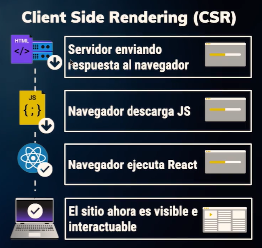
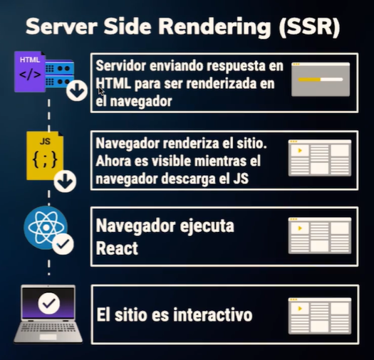

# Curso de Server Side Rendering con Express

## *Escuela de JavaScript - Platzi 2019*

---

---

## Client Side Rendering (CSR)

Normalmente cuando hacemos una petición al servidor, tenemos que esperar a que el servidor responda nuestro html, cargue nuestro código Javascript, lo ejecute y en ese momento nuestro sitio llega a ser interactivo.

En el caso de React, tenemos que espera a que pase todo el html, despues llegá el Javascript, carga react y el sitio en ese momento llega ha ser interactivo.



Lo malo de esto es que al momento de tener un sitio, si ven que se mira blanco en la primera carga es porque no tenemos el SSR(server side rendering), normalmente hay varias razones por las que usamos el client side rendering, cuando son vistas privadas no hay necesidad de esforzarnos mucho porque algó se indexe y simplemente no habilitamos el SSR, en esté caso la forma más rápida de revizarlo es desabilitando Javascript de nuestro navegador, pues no estamos recibiendo ese código, es decir no estamos ejecutandolo y simplemente nuestro sitio no se renderiza.

<div align="right">
  <small><a href="#tabla-de-contenido">🡡 volver al inicio</a></small>
</div>

## Server Side Rendering

El SSR (server side rendering) funciona de manera similar pero un poco más eficiente, porque al momento de hacer la petición a nuestro html, nosotros tomamos nuestro código de react en esté caso lo renderizamos en un string, le hacemos un **apend**, lo incertamos dentro de nuestro html para que cargue toda la parte visual, esa parte visual vamos a cargarla y luego en paralelo mientras estamos subiendo el código ya una vez que tenemos feedback, ese código se va ha ir desacargando, el código Javascript es decir el mismo código que descargamos es el mismo código que estamos renderizando, con la diferencia de que al momento de llegar al cliente, y al momento de ejecutar React se usa un método que se llama ``aidry`` que precisamente como ya tenemos un código precargado vamos a incertarle una serie de enventos que solo estan disponibles en el cliente, esto garantiza que nuestro sitio va ha ser interactivo mucho más rápido y la percepción del usuario es que nuestro archivo va ha ser mucho más limpio y va ha tener mucho mejor ``look an feel``, es decir va ha tener una percepción mucho más limpía de nuestro sitio.

Otro ejemplo muy fácil es buscar un sitio o una vista que carga con SSR como la home de [platzi](https://platzi.com/), la gran diferencia de esto es que si desabilitamos el Javascript del sitio web y refrescamos inmediatamente el sitio es visible y si hacemos una revisión de nuestro código.



Hay una pequeña carga blanca pero es minima comparada con un código que no tiene SSR. Normalmente el Client Side Renderig se usa para rutas privadas, y el Server Side Rendering se usa cuando necesitamos un feedback mucho más rápido para que nuestro sitio sea indexado, o simplemente para garantizar la experiencia del usuario en cualquier lado.

<div align="right">
  <small><a href="#tabla-de-contenido">🡡 volver al inicio</a></small>
</div>

### ¿Por qué renderizar desde el Servidor?

Son 3 puntos muy importantes los cuales los hemos tocado en la sección anterior.

1. **La carga es mucho más rápida**, esto es muy bien visto por motores de busquedad, si tu tienes un sitio que carga mucho más rápido tus usuarios no se van del sitio y aparte de eso la percepción del usuario ante el sitio es que se quieren quedar.
2. **Mejora el SEO**, no solo estamos cargando un SPA por ejemplo que tiene CSR, solo estamos tomando en cuenta los metaTags del tope de la página pero ya ahora estamos tomando la indexación del todo el cóntenido de React que se esta precargando.
3. **Look and Feel** dependiendo de la zona o de la url en la que estemos o en la sección del sitio, es muy importante mantener una **percepción del usuario** que se sienta comodo con el sitio, por ejemplo en el landing es muy importante tener Server Side Rendering, porque nos ayuda a indexar todo el contenido html porque el final todo estó va ha mejorar nuestro CEO. Con esto el navegador puede desacargar por atras pero mientras el usuario ya tiene un feedback inmediato.

<div align="right">
  <small><a href="#tabla-de-contenido">🡡 volver al inicio</a></small>
</div>

## Herramientas

Babel, Express y React

Para el desarrollo de este curso vamos a utilizar 3 herramientas esenciales:

- Babel: transforma nuestro código a una versión de JavaScript que cualquier navegador pueda entender.
- Express: es un framework de aplicaciones web en Node.js que nos va a ser útil para crear nuestro servidor.
- React: librería de JavaScript para crear componentes y nos proporciona un método para renderizar nuestros componentes del lado del servidor.

Renderizar del lado del servidor nos va a traer beneficios en:

1. Velocidad de primera carga.
2. Mejora el SEO.
3. Look & Feel más limpio.

<div align="right">
  <small><a href="#tabla-de-contenido">🡡 volver al inicio</a></small>
</div>

## Creación del proyecto base

Para esta clase vamos a empezar a separar nuestro proyecto en diferentes carpetas: frontend y server. Dentro de frontend vamos a guardar todos los archivos que anteriormente Oscar realizó en el curso de React y React Router Redux.

Además vamos a crear nuestro primer servidor en express que nos va ha ayudar a servir nuestra aplicación del lado del servidor.

El archivo ``index.js`` dentro de nuestro server va ha ser el punto de ancla para que nuestra aplicación funcione, nuestro servidor va ha correr desde acá, lo primero que debemos de hacer es instalar las siguientes dependencias.

```js
@babel/register
express
dotenv
// dependencia de desarrollo:
nodemon
```

Babel register es un paquete que mediante un hook de require nos permite hacer un bind en tiempo real de cualquier paquete que necesitemos, en esté caso vamos a estar haciendo un bind de babel-preset-env y babel-preset-react.

<div align="right">
  <small><a href="#tabla-de-contenido">🡡 volver al inicio</a></small>
</div>

## Configuración de ESLint con Webpack

ESLint es una herramienta que nos señala el código que no cumpla con los estándares que le indiquemos. Se configura desde un ``.eslintrc``. Debemos instalar las siguientes dependencias:

```
yarn add babel-eslint eslint eslint-config-airbnb eslint-plugin-jsx-a11y eslint-loader eslint-plugin-import eslint-plugin-react   --exact
```

Dentro del archivo ``.eslintrc`` podemos indicarle a ESLint el nivel de alerta sobre una regla:

- 2: error
- 1: warning
- 0: omite la regla

<div align="right">
  <small><a href="#tabla-de-contenido">🡡 volver al inicio</a></small>
</div>

## Preparación de Webpack, Babel, PostCSS y Assets

Ahora vamos a realizar una serie de inprudments a nuestro ``.babelrc`` para que podamos tener diferentes entornos de trabajo y también vamos a agregarle los prefijos necesarios a nuestro código _css_ con autoprefixer con ``post-css`` y ``webpack``.

1. Dentro de ``babelrc`` debemos enviarle un entorno que estemos trabajando con nuestro ``.env``, el cual nos debe de indicar el entorno en el que estesmos trabajando.

```json
{
  "presets": [
    "@babel/preset-env",
    "@babel/preset-react"
  ],
  "env": {
    "development": {
      "plugins": [
        // para poder utilizar clases en JSX sin ningún problema
        "transform-class-properties",
        // para añadir carga dinámica del contenido en nuestro proyecto
        "react-hot-loader/babel",
        "babel-plugin-transform-object-assign"
      ]
    }
  }
}
```

2. Ahora vamos a proceder a configurar nuestros assets, pero como ya tenemos assets definidos en nuestro webpack, lo que nos hace falta acá es precisamente poder añadirles ciertas funcionalidades al css para que se pueda ejecutar en cualquier navegador en esté caso los prefijos, para poder usar estos prefijos nos vamos a apoyar de 2 paquetes. `
```
yarn add autoprefixer --exact
npm install autoprefixer --save-exact

yarn add postcss-loader --exact
npm install postcss-loader --save-exact 
```

Los prefijos necesarios debemos tratarlos con un ``postcss-loader``, como todavia no estamos usando ``autoprefixer`` vamos a proceder a instalar un plugin nuevo, esté plugin que vamos a estar trabajando precisamente va ha añadir la configuración que necesitamos para poder agregarle el **autoprefijo** a la configuración de css. 

```js
{
  plugins: [
    new webpack.LoaderOptionsPlugin({
        options: {
          postcss: [
            autoprefixer(),
          ],
        },
      }),
  ]
}
```

Precisamente esta función lo que hace es que vamos a cargar ciertas funciones para un loader en especifico. Ya con esto podríamos tener nuestra configuración y nuestro css ya configurado para que agregue todas las funcionalidades necesarias para poder correr en cualquier navegador.

3. Configuración de archivo **postcss.config.js** 
```js
module.exports = {
  plugins: {
    'autoprefixer': {},
  },
};
```
<br>

<div align="right">
  <small><a href="#tabla-de-contenido">🡡 volver al inicio</a></small>
</div>

## Usando Plugins y vendor file en Webpack

En está clase vamos a realizar una estrategia que es **vendorFiles** para poder separar los ``node_modules`` de nuestro assets normales de la aplicación para poder cachearlos en el navegador y que no tengamos ningún problema.

Los vendorFiles son una herramienta de optimización para que nuestro proyecto tenga una configuración mucho más eficiente para mandar a producción, para estó webpack recibe un párametro que se llama ``optimization``, esté es un objeto.

```js
{
    optimization: {
    splitChunks: {
      chunks: 'async',
      // el modulo va ha tener un nombre
      name: true,
      // aquí vamos a definir nuestro vendor
      cacheGroups: {
        // usamos el método de vendors
        vendors: {
          // nombre de la optimization
          name: 'vendors',
          // obtener los modules de todo nuestro código
          chunks: 'all',
          // va ha reuzar un chunk existente
          reuseExistingChunk: true,
          // debe ejecutarse primero que el bundle de react
          priority: 1,
          // nombre y lugar donde lo vamos a guardar
          filename: 'assets/vendor.js',
          // tiene que hacer esto obligatoriamente
          enforce: true,
          // configuración para que nuestro archivo vendors se obtenega
          // únicamente de nuestro node_modules
          // va ha extraer todas las importaciones que vengan de node_modules y las va ha pasar a un paquete aparte 
          test(module, chunks) {
            const name = module.nameForCondition && module.nameForCondition();
            return chunks.some((chunks) => chunks.name !== 'vendor' && /[\\/]node_modules[\\/]/.test(name));
          },
        },
      },
    },
  },
}
```

Ahora procedemos a configurar el ``hotModeReplacement`` que simplemene es instanciarlo dentro de webpack.

```js
{
   plugins: [
    new webpack.HotModuleReplacementPlugin(),
  ];
}
```

<div align="right">
  <small><a href="#tabla-de-contenido">🡡 volver al inicio</a></small>
</div>

## Integración de Webpack con Express

Ya que configuramos webpack he hicimos nuestro servidor ahora debemos integrarlos y para eso debemos primero revizar que todo esté en orden porque es muy usual cuando estas trabajando día a día que tengas ``typos`` al momento de realizar alguna configuración de estás porque tienen muchos párametros que son sensibles a typos.

Para poder configurar nuestro servidor de express y que funcione con webpack.

1. Vamos a ir a nuestro archivo ``server.js`` y vamos a modificarlo con lo siguiente:

Vamos a hacer una validación para verificar que estemos en desarrollo porque también vamos a configurar el hot-mode-replacement, y está configuración no se puede hacer en entornos de producción.

```js
const express = require('express');
const webpack = require('webpack');
const { config } = require('../config');

if(config.dev) {
  console.log(`Cargando configuración de desarrollo`);
  // llamamos a nuestra configuración de webpack
  const webpackConfig = require('../../webpack.config');
  const webpackDevMiddleware = require('webpack-dev-middleware');
  const webpackHotMiddleware = require('webpack-hot-middleware');
  // definimos un compilador, esté compilador lo vamos a llamar con webpack usando nuestra configuración de webpackConfig.
  // que es la configuración que hemos trabajado durante todo el proyecto, para que las sirva sin nigún porblema
  const compiler = webpack(webpackConfig);
}
```

Lo más importante de estó es crear la configuración del servidor porque como vamos a estar sirviendo webpack desde el servidor es muy importante crear la configuración necesaria.

```js
const configServer = {
  contentBase: `http:/localhost${config.port}`,
  port: config.port,
  publicPath: webpackConfig.output.path
  // recibirá cambios dinámicamente
  hot: true,
  // para recibir colores en nuestro proyecto
  stats: {colors: true},
}
```

Por ahora ninguna de las configuraciones que definimos se está usando, para poder usarlas sencillamente debemos primero pasarle un ``historyFallback: true` y aparte de estó tenemos que decirle a nuestra aplicación de express que use estos middlewares que tenemos acá definidos.

```js
  app.use(webpackDevMiddleware(compiler, serverConfig));
  // añade la configuración de HotModeReplacement
  app.use(webpackHotMiddleware(compiler));
```

La configuración unida quedaría de la siguiente manera:
```js
const express = require('express');
const webpack = require('webpack');
const { config } = require('../config');

const app = express();

if (config.dev) {
  console.log('Cargando la configuración de desarrollo');
  const webpackConfig = require('../../webpack.config');
  const webpackDevMiddleware = require('webpack-dev-middleware');
  const webpackHotMiddleware = require('webpack-hot-middleware');
  const compiler = webpack(webpackConfig);
  const serverConfig = {
    contentBase: `http://localhost${config.dev}`,
    port: config.port,
    publicPath: webpackConfig.output.publicPath,
    hot: true,
    historyApiFallback: true,
    stats: { colors: true },
  };

  app.use(webpackDevMiddleware(compiler, serverConfig));
  app.use(webpackHotMiddleware(compiler));
}

app.get('*', (req, res, next) => {
  res.send({holamundo: true})
});

app.listen(config.port, (err) => {
  if (err) console.log(err);
  console.log(`El servidor está corriendo en htpp://localhost:${config.port}`);
});
```

<div align="right">
  <small><a href="#tabla-de-contenido">🡡 volver al inicio</a></small>
</div>

## Servir React con Express

Hasta ahora hemos configurado webpack y le hemos añadido ciertas funcionalidades para que se integre con nuestro servidor de express, pero no hemos configurado tadavía que nuestra aplicación se sirva desde un html que sirvamos de nuestro servidor.

Lo primero que tenemos que hacer es hacer ciertas modificaciones a nuestro archivo de webpack porque como estabamos revizando tenemos ciertas extensiones y ciertas integraciones que ya no vamos a estar usando por ejemplo: la integración del **htmlWebpackPlugin** ya no va ha ser necesaria porque vamos a estar sirviendo todo desde express.

Usualmente cuando estamos trabajando en entornos de desarrollo necesitamos indicarle a webpack exactamente en que entorno estamos trabajando, para esto tenemos que especificarle el modo.

``mode: "development"`` 

Si no indicamos que estamos trabajando en modo desarrollo nuestra aplicación va ha entrar directamente en modo de producción y esto nos puede presentar problemas a la hora de resolver ciertos paquetes o ciertas rutas, otra cosa que debemos hacer es cambiar el **path**, el paht **debe ser cambiado al source del proyecto**.

Por último tenemos que enviar un templateString con nuestra aplicación html, más que una convección es un modo de realizar estó, también creando un archivo html y cargandolo desde acá, pero como vamos a hacer un html estatico que en realidad no va ha cambiar mucho no vale la pena crear un archivo para eso.

Lo que debemos hacer en esté caso es crear nuestro html dentro de un template String.

```html
<!DOCTYPE html>
<html>
  <head>
    <title>PlatziVideo</title>
    <link rel="stylesheet" href="assets/app.css" type="text/css">
  </head>
  <body> 
    <div id="app"></div>
    <script src="assets/app.js" type="text/javascript"></script>
    <script src="assets/vendor.js" type="text/javascript"></script>
  </body>
<html>
```

Con estó ya estaríamos sirviendo nuestra aplicación desde el servidor.

<div align="right">
  <small><a href="#tabla-de-contenido">🡡 volver al inicio</a></small>
</div>

## Agregando las variables de sass desde webpack

Ya que tenemos nuestra apliación de React servida desde express podemos empezar a hacer ciertas mejoras a la configuración de sass, para poder servir archivo de variables, base o cualquier cosa que necesitemos desde sass que solo vamos a importar una sola vez desde ahí para no estarnos preocupando en dado caso de que falte.

Lo primero que tenemos que hacer es ir a nuestra configuración de webpack y vamos a modificar nuestra configuración de sass, acá ya podemos remover nuestro _html-loader_. Vamos a tomar nuestro sass-loader que nos va ha permitir configurar todo estó, vamos a abrir unas llaves acá y vamos indicarle por separado que vamos a mandarle el loader, usualmente los loader reciben ciertas opciones como lo puedes verificar en la documentación de cada loader, pero en esté caso sass-loader recibe un elemento options.

Esté elemento options nos va ha permitir en esté caso cargar con data cualquier dato que necesitemos agregar cuando lo necesitemos, acá vamos apoder agregar las variables que ya definimos usando un template-string.

```js
{
        test: /\.(s*)css$/,
        use: [
          {
            loader: MiniCssExtractPlugin.loader,
          },
          'css-loader',
          'postcss-loader',
          {
            loader: 'sass-loader',
            options: {
              data: `
                @import  "${path.resolve(__dirname, './src/frontend/assets/styles/Vars.scss')}";
                @import  "${path.resolve(__dirname, './src/frontend/assets/styles/Media.scss')}";
              `,
            },
          },
        ],
      },
```

Para terminar está configuración debemos remover el import de los assets que estamos agregando acá.

<div align="right">
  <small><a href="#tabla-de-contenido">🡡 volver al inicio</a></small>
</div>

## Aplicando history y creando rutas para el servidor

Ya que aprendiste a configurar variables por defecto del lado de webpack ahora vamos al cliente y vamos a hacer ciertos cambios para que primero nuestro navegador tenga historia y luego vamos aplicar ciertas mejoras y crear un archivo de ``serverRoutes.js`` para poder preparar todo nuestro entorno para el **server side rendering** 

Primero debemos intalar una dependencia que se llama **history** y está dependencia nos va ha añadir ciertas funcionalidades a **react-router** para que tenga una historia para que cuando vallamos de un lado a otro se conserve en el navegador, luego de estó vamos a las rutas, acá nos damos cuenta que tenemos unas rutas definidas, antes tenemos que ir a nuestro archivo index y crear nuestra historia como tál.

1. Vamos a importat Router el cuál vamos a importar de ``react-router``.
2. vamos a importar exactamente lo que necesitamos que es la historia del navegador, en esté caso vamos a importar el ``createBroserHistroy`` de ``history``
3. Ahora vamos a crear nuestra historía, creamos una variable y llamamos a la función ``createBroserHistroy`` y ya con esto tendríamos una historia.
4. Para indicarle a react-router que hay una historia, llamamos a ``Router`` y hacemos un wrapper de nuestros componentes y luego le vamos a decir que tenga un history.

```js
import React from 'react';
import ReactDOM from 'react-dom';
import { Provider } from 'react-redux';
import { createStore, compose } from 'redux';
import { Router } from 'react-router';
import { createBrowserHistory } from 'history';
import reducer from './reducers';
import App from './routes/App';
import initialState from './initialState';

  const store = createStore(reducer, initialState);
  const history = createBrowserHistory();

  ReactDOM.render(
    <Provider store={store}>
      <Router history={history}>
        <App />
      </Router>
    </Provider>,
    document.getElementById('app'),
  );
};
```

Ya con el history creado necesitamos también preparar las rutas para el servidor. Primero tenemos que crear las rutas exactamente iguales como las tenemos en el navegador.

¿Por qué tenemos que prepararlas para el servidor?

Como podemos ver en nuestras Routes tenemos un browserHistory, esté browser history no existe en el servidor y cuando el servidor intente acceder a estó nos va ha decir que no existe como tál un navegador.

Vamos a crear un archivo ``serverRoutes.js``, esté objeto va ha tener la misma cantidad de rutas que tenemos definidas.

```js
import Home from '../containers/Home';
import Login from '../containers/Login';
import Register from '../containers/Register';
import NotFound from '../containers/NotFound';

const serverRoutes = [
  {
    path: '/',
    component: Home,
    exact: true,
  },
  {
    path: '/login',
    component: Login,
    exact: true,
  },
  {
    path: '/register',
    component: Register,
    exact: true,
  },
  {
    name: 'NotFound',
    component: NotFound,
  },
];

export default serverRoutes;
```

<div align="right">
  <small><a href="#tabla-de-contenido">🡡 volver al inicio</a></small>
</div>

## Haciendo initialState accesible 

Ya que aprendiste a configurar el history en el navegador y también a configurar las rutas para que sean servidas del lado del servidor, ahora vamos a hacer un poco más reusable el _initialState_.

Como puedes ver el initialState no es para nada reusable porque nos esta presentando ciertos problemas, cuando vayamos a servir nuestra aplicación del servidor tenemos que crear otro objeto exactamente igual, lo que tendremos que hacer es exportarlo, es decir crear un archivo y exportarlo ahí.

El objeto que vamos a crear debe ser exactamente igual al initialState que vamos a exportar.

```js
module.exports = {
  // objeto initialState
}
```

Ahora lo que vamos a hacer es importarlo al lugar donde lo vamos a ocupar y de esté modo ya tenmos un código más reuzable.

<div align="right">
  <small><a href="#tabla-de-contenido">🡡 volver al inicio</a></small>
</div>

## Configurando Redux dev Tools

Redux dev Tools es una extensión de chrome el cual nos ayuda a manejar nuestros estados, para poder saber como se esta comportando exactamente nuestra aplicación en tiempo real, porque hasta ahora estamos manejando redux internamente pero no sabes que está pasando en nuestra aplicación, no sabes si se ejecuta una función o un acction. Para instalarla debemos ir a nuestro navegador y en extensiones instalarla.

Para integrarlo con nuestro código es muy sencillo, llamamos al método compose en ``redux`` el cual funciona como un middleware, todo lo que ejecutemos lo va ha ejecutar dentro de ahí para pasarselo a redux.

vamos a agregar está opción a nuestro store.

```js
import React from 'react';
import ReactDOM from 'react-dom';
import { Provider } from 'react-redux';
import { createStore, compose } from 'redux';
import { Router } from 'react-router';
import { createBrowserHistory } from 'history';
import reducer from './reducers';
import App from './routes/App';
import initialState from './initialState';

const composeEnhancer = window.__REDUX__DEVTOOLS_EXTENSION_COMPOSE_ || compose;
const store = createStore(reducer, initialState, composeEnhancer());
const history = createBrowserHistory();

ReactDOM.render(
    <Provider store={store}>
      <Router history={history}>
        <App />
      </Router>
    </Provider>,
    document.getElementById('app'),
  );
```

Gracias a esto podemos ver todo el flujo de nuestra aplicación con esta extensión.

<div align="right">
  <small><a href="#tabla-de-contenido">🡡 volver al inicio</a></small>
</div>

## Definiendo la función main para renderizado desde el servidor

A lo largo de esté documento hemos visto diferentes estrategias y diferentes procesos para poder hacer el server side rendering pero hasta ahora no lo hemos aplicado, hemos modificado las rutas, hemos abstraido el initialState, hemos configurado redux dev tools, hemos echo algunas modificaciones con nuestro servidor de express, pero a continuación vamos a ver como se hace el propiamente el server side rendering.

Para poder configurar nuestro servidor para que renderice nuestra aplicación de React, primero debemos hacer ciertas modificaciones, una de las modificaciones que tenemos que hacer es que la función que de nuestra app, la que tiene ``(req, res, next)`` no esta bien tenerlo por acá porque aqui vamos aplicar la logica de la respuesta a aplicación.

Para poder tener una configuración más eficiente debemos configurar una nueva carpeta que se va ha llamar routes, la cuál vamos a definir primero, aquí vamos  crear una ruta que se va ha llamar ``main``  


Esté archivo **main.js** va a tener toda la lógica que estamos renderizando en nuestro servidor, es decir toda la lógica que tenemos en esa ruta la vamos a pasar a nuestro archivo main, pero primero tenemos que hacer ciertas cosas.

Para empezar el proceso de renderizado desde el servidor, primero tenemos que importar React, porque vamos a llamar a nuestros componentes tál cual como si estuviesemos llamando a nuestra aplicación en el archivo index con ciertas modificaciones vamos a llamar estó acá. Porque tenemos una dependencia que se llama ``react-dom`` y react-dom nos proporciona un método que se llama ``renderToString``, el **renderToString** lo que permite es precisamente renderizar el componente o una apliación de React a un String.

También tenemos que importar el **createStore**, acá no necesitamos configurar redux-dev-tools desde el lado del servidor y aparte de estó necesitamos crear o instanciar en esté caso un elemento que se llama **StaticRouter**, el react-router no tiene como tál una ruta en el servidor.

**StaticRouter**: crea una ruta estatica o una ruta que no cambié para que el servidor no tenga ningún problema al momento de crear las rutas a las que vamos a estar enviando nuestra aplicación. esté método lo proporciona **react-router**.

Otro paquete que es necesario instalar es ``react-router-config``. **react-router-config**: lo que nos permite es tener un método, vamos a acceder a un método que se llama **render-routes** y ahí vamos a poder renderizar las rutas del **staticRouter** que ya estamos definiendo.

```js
import React from 'react';
import { renderToString } from 'react-dom';
import { Provider } from 'react-redux';
import { createStore } from 'redux';
import { staticRouter } from 'react-router';
import { renderRoutes } from 'react-router-config';
```

Luego de estó debemos que importar nuestra rutas, pero nuestro archivo de rutas que debemos importar en esté caso son las rutas del servidor.

```js
import Routes  from '../../frontend/routes/serverRoutes';
```

Luego de estó tenemos que importar un archivo que es necesario, porque sucede que nuestra app en esté caso que son las rutas que ya tenemos definidas. Se está definiendo un Layout para que nuestras rutas tengan una especie de Wrapper encerrando todo lo que tenga que ver la lógica de Switch pero en el Servidor, las rutas del servidor no tenemos estó, para ello tenemos que proceder ha importar esté Layout para poder hacer el Wrapper manual y no tener ningún problema luego de que hallá algún problema o diferencias entre el server y el cliente.

```js
import Layout from '../../frontend/components/Layout';
// también vamos a llamar a los archivos para contruir nuestro Store
import reducer from '../../frontend/reducers';
import initialState from '../../frontend/initialState';
```

Luego de estó vamos a definir una función la cual nos va ha ayudar a renderizar toda nuestra aplicación, porque ahora tenemos nuestro archivo ``server.js`` renderizando nuestro template, pero esté template no debería de ir acá porque si ponemos toda la lógica acá luego no va ha poder ser reutilizable, supongamos que tenemos 2 bundles, si tenemos que definir estó para el Home y luego queremos llamar otra aplicación desde otra ruta, tendremos que redefinir todo el proceso y llamar 2 veces y estó no es eficiente.

Lo que podemos hacer esn esté caso es que podemos crear un helper es esté helper será un método render, el cual vamos a llevar a una nueva carpeta por cuestiones de organización. Nuestro archivo render en pocas palabras va ha ser esté archivo que tenemos en el server, que luego vamos a llamar desde nuestra ruta principal.

```js
const render = (html) => {
  return (`
  <!DOCTYPE html>
  <html>
    <head>
      <title>Platzi Video</title>
      <link rel="stylesheet" href="assets/app.css" type="text/css">
    </head>
    <body>
      <div id="app"></div>
      <script src="assets/app.js" type="text/javascript"></script>
      <script src="assets/vendor.js" type="text/javascript"></script>
    </body>
  </html>
  `);
};

module.exports = render;
```

Ya que tenemos nuestra función render vamos a seguir con nuestro archivo de Ruta, y vamos a empezar a usar, esté modulo que acabamos de crear de nuestro templateString.

```js
import render from '../render';
```

```js
const main = (req, res, next) => {
  try {
    const store = createStore(reducer, initialState);
  } catch(err) {
    next(err);
  }
} 

export default main;
```

<div align="right">
  <small><a href="#tabla-de-contenido">🡡 volver al inicio</a></small>
</div>

## Aplicando la función main para renderizado desde el servidor y creación del string de HTML

En la clase anterior definimos la función main y la función render, para poder preparar nuestro servidor para el renderizado. En está clase vas ha aprender como aplicar los conceptos y las funciones que ya previamente definimos he integramos en nuestra aplicación para renderizarla en el lado del servidor, ahora vamos a definir una constante que se va ha llamar ``html`` que precisamente está constante es la que vamos a enviar a nuestra función ``render``. Acá vamos a pasar la estructura correcta para que nuestro componente sea renderizado.


```jsx
const main = (req, res, next) => {
  try {
    const store = createStore(reducer, initialState);
    const html = renderToString(
      <Provider>
        <StaticRouter
          location={req.url}
          context={{}}
        >
          <Layout>
            {renderRoutes(Routes)}
          </Layout>
        </StaticRouter>
      </Provider>
    );

    res.send(render(html));

  } catch(err) {
    next(err);
  }
}
```

Luego vamos a nuestro archivo ``server.js`` y acá es donde nosotros vamos a llamar a nuestra main, que es esté archivo que acabamos de crear.

```js
const express = require('express');
const webpack = require('webpack');
const { config } = require('../config');
const main = require('./routes/main');

const app = express();

if (config.dev) {
  console.log('Cargando la configuración de desarrollo');
  const webpackConfig = require('../../webpack.config');
  const webpackDevMiddleware = require('webpack-dev-middleware');
  const webpackHotMiddleware = require('webpack-hot-middleware');
  const compiler = webpack(webpackConfig);
  const serverConfig = {
    contentBase: `http://localhost${config.dev}`,
    port: config.port,
    publicPath: webpackConfig.output.publicPath,
    hot: true,
    historyApiFallback: true,
    stats: { colors: true },
  };

  app.use(webpackDevMiddleware(compiler, serverConfig));
  app.use(webpackHotMiddleware(compiler));
}

// ACÁ LLAMAMOS A MAIN
app.get('*', main);

app.listen(config.port, (err) => {
  if (err) console.log(err);
  console.log(`El servidor está corriendo en htpp://localhost:${config.port}`);
});
```

Si levantamos nuestro servidor en esté momento nos marcará un error con nuestras hojas de estilo. Lo que sucede es que del lado del servidor no podemos llamar hojas de estilo, porque no podemos aplicar estilos a un servidor como tál, lo que tenemos que hacer es instalar una dependencia, que se llamá ``ignore-styles``, y precisamente nos ayuda a ignorar estos estilos con un hook del lado del servidor.

Ahora solo tenemos que llamarla desde nuestro index con un require, acá babel se encarga de crear estas configuraciones antes de llamar a nuestro ``server.js``

```js
require('ignore-styles');

require('@babel/register')({
  ignore: [/(node_modules)/],
  presets: ['@babel/preset-env', '@babel/preset-react'],
});

require('./server.js');
```

Una vez hecho estó podremos ver que ya nuestra aplicación se está ajecutando, pero aquí hay un detalle, y es que nuestra aplicación si desabilitamos JS, nod daremos cuenta que sigue faltando ``server-side-rendering``. Estó sucede porque no estamos enviando el html, que definimos en main con las configuraciones necesarias, acá lo único que tenemos que hacer es enviar el html que recibimos por parametro a nuestro templateString

```js
const render = (html) => {
  return (`
  <!DOCTYPE html>
  <html>
    <head>
      <title>Platzi Video</title>
      <link rel="stylesheet" href="assets/app.css" type="text/css">
    </head>
    <body>
      <div id="app">${html}</div>
      <script src="assets/app.js" type="text/javascript"></script>
      <script src="assets/vendor.js" type="text/javascript"></script>
    </body>
  </html>
  `);
};

module.exports = render;
```

Ahora si recargamos nuestro servidor y desabilitamos JS podemos podemos ver que nuestra aplicación sigue funcionando y estó nos indica que ya estamos haciendo un renderizado desde el servidor.

Por ahora no tenemos imagenes, el cual resolveremos más adelante con un hook, pero tenemos nuestra aplicación indexable para que cualquier motor de búsquedad pueda ayudarnos a resolverla, otra cosa importante es que la apariencia del sitio se siente mucho más rápida al momento de la carga.

<div align="right">
  <small><a href="#tabla-de-contenido">🡡 volver al inicio</a></small>
</div>

## Assets require hook

Como pudimos ver nuestra aplicación ya se está renderizando desde el servidor pero seguimos teniendo ciertpos problemas como por ejemplo las imagenes, cuando hacemos JS con el JS desabilitado podemos ver que no tenemos imagenes en las rutas que necesitamos, vamos a solucionarlo acá.

Lo primero que tenemos que hacer es instalar un paquete que se llamá **asset-require-hook** estó lo que nos permite en pocas palabras es indicarle donde están los assets de nuestra aplicación.

Una vez instalada la dependencia tenemos hacer la configuración dentro de nuestro index principal.

```js
require('asset-require-hook')({
  extensions: ['jpg', 'png', 'gif'],
  name: '/assets/[hash].[ext]',
});
```

Ya con está configuración podemos ver que ya estamos cargando nuestros assets desde el servidor.

<div align="right">
  <small><a href="#tabla-de-contenido">🡡 volver al inicio</a></small>
</div>

## Hydrate

Ya que tenemos nuestra aplicación renderizada desde el servidor con imagenes preparadas y todos los assets requeridos, necesitamos optimizar la carga del sitio.

¿Como vamos a optimizar la carga del sitio?

Lo haremos implementando un método llamado ``hydrate``. Actualmente nuestra aplicación está renderizando un string y ese string luego se monta al cliente cuando carga la librería de react se ejecuta react y hace un render, al llamar el render otra vez es que se esta re-renderizando la aplicación, con **hydrate** resolvemos esté problema, porque lo que hace es un ``bind`` a los eventos y llamá a todos los eventos necesarios que tenemos disponibles en el navegador  para que no tengamos que llamar 2 veces el mismo contenido.

Lo que debemos hacer para poder hidratar nuestra aplicación es que debemos ir a frontend y dentro del archivo ``index.js`` del frontend, y vamos a cambiar el ``ReactDOM.render`` por ``hydrate``, lo que sucede es que nuestra aplicación se vuelve un poco ineficiente con está configuración del ``ss-r`` porque está haciendo un doble render.

```js
import React from 'react';
import { hydrate } from 'react-dom';
  hydrate(
    <Provider store={store}>
      <Router history={history}>
        <App />
      </Router>
    </Provider>,
    document.getElementById('app'),
  );
```

Esté simple cambio va ha mejorar un montón el performace de la aplicación y va ha hacerla ejecutable mucho más rápido.

<div align="right">
  <small><a href="#tabla-de-contenido">🡡 volver al inicio</a></small>
</div>

## Estado de Redux desde Express

Otra cosa muy importante es que nuestros estados se están enviando 2 veces, como podemos notar acá en el archivo frontend de index, estamos definiendo un store, con un initalState y luego en el servidor, también estamos haciendo lo mismo, esto es un poco ineficiente porque si llegamos a cambiar una cosa o la otra es que estamos cargando el mismo archivo y la idea es que todo nuestro estado permanezca desde el servidor y sea enviado al cliente.

Lo que debemos hacer en esté caso es ir a la documentación de Redux 

- https://redux.js.org/recipes/server-rendering

Lo que vamos a buscar en esté caso es como vamos a renderizar nuestra aplicación y como vamos a enviar el estado que en esté caso se llamaría ``preloadedState``, esté preloadeState lo vamos a definir en el index de la ruta pricipal que sería la ruta **main** y vamos a llamarlo y definirlo.

El preloadedState va a recibir el estado por medio del store y lo vamos a pasar como segundo párametro a nuestra función. 

```js
const preloadedState = store.getState();
res.send(render(html, preloadedState));
```

Para luego tal cúal como dice la documentación vamos a incertarlo en un script para cargarlo como un ``preloadedState`` para luego ser cargado o reidratado en nuestra aplicación.

```js
const render = (html, preloadedState) => {
  return (`
  <!DOCTYPE html>
  <html>
    <head>
      <title>Platzi Video</title>
      <link rel="stylesheet" href="assets/app.css" type="text/css">
    </head>
    <body>
      <div id="app">${html}</div>
      <script>
          // WARNING: See the following for security issues around embedding JSON in HTML:
          // http://redux.js.org/recipes/ServerRendering.html#security-considerations
          window.__PRELOADED_STATE__ = ${JSON.stringify(preloadedState).replace(/</g, '\\u003c')}
        </script>
      <script src="assets/app.js" type="text/javascript"></script>
      <script src="assets/vendor.js" type="text/javascript"></script>
    </body>
  </html>
  `);
};

module.exports = render;
```

Ahora vamos a ir a nuestro archivo index del frontend y vamos a eliminar el import del ``initialState`` y vamos a proceder a definir nuestro preloadedState, para ello crearemos una constante **para recibir el state desde el objeto window**

```js
const preloadedState = window.__PRELOADED_STATE__;
const store = createStore(reducer, preloadedState, composeEnhacers());

const history = createBrowserHistory();

  hydrate(
    <Provider store={store}>
      <Router history={history}>
        <App />
      </Router>
    </Provider>,
    document.getElementById('app'),
  );
```

Ya con estó estaríamos reidratando el estado y no tendríamos necesidad de llamar 2 veces el mismo estado.

Una cosa más que deberíamos agregar en las validaciones y en la configuración de nuestro servidor es precismante como vamos a diferenciar que existe en nuestro servidor o en nuestro cliente. La forma más sencilla de configurar estó es validar el **typeof** de **window** que seá diferente de **undefined**.

Por lo generarl debemos hacer binds a eventos que existen solo en el window, por ejemplo si queremos usar un localStorage, pues no hay esté elemento en el servidor. Esto lo hacemos para que nuestra aplicación no deje de funcionar en dado caso de que no encuentre el objeto dentro de window.

```js
if (typeof window !== 'undefined') {

  const composeEnhacers = window.__REDUX_DEVTOOLS_EXTENSION_COMPOSE__ || compose;
  const preloadedState = window.__PRELOADED_STATE__;
  const store = createStore(reducer, preloadedState, composeEnhacers());
  const history = createBrowserHistory();

  hydrate(
    <Provider store={store}>
      <Router history={history}>
        <App />
      </Router>
    </Provider>,
    document.getElementById('app'),
  );
};
```

Con esto vamos a olvidarnos del problema de cuando estemos reidratando la aplicación algó se dañe y no podamos reidratar correctamente la aplicación.

Hasta esté punto nuestra aplicación ya tiene server side rendering, ya es indexable por motores de busquedad, ya tiene un look an field más rápido y nuestros usuarios estarán más felices de estar en nuestro sitio.

Los siguientes pasos van ha ser aplicar ciertas medidas para que cuando pasemos de un entorno a otro sea desarrollo o producción podamos hacer el cambio sin nigún tipo de problema.

<div align="right">
  <small><a href="#tabla-de-contenido">🡡 volver al inicio</a></small>
</div>

## Configurando nuestro servidor para producción

El siguiente paso es agregarle ciertas configuraciones a nuestro servidor de express para que cuando integremos con producción no tengamos ningún tipo de problema al momento de ejecutar nuestra aplicación.

Para preparar nuestra aplicación para producción primero debemos hacer es revizar ciertas medidas de seguridad que debemos tener, para eso nos vamos a apoyar en ``helmet``, esté es un paquete que nos va ha ayudar con la seguridad tanto básica como avanzada de nuestro sitio, como puedes ver una vez que nosotros integramos helmet tenemos ciertos modulos y ciertas politicas de privacidad que vienen por defecto y otras que debemos activar manualmente.

1. instalamos helmet ``yarn add helmet --exact``.
2. Una vez instalado helmet debemos hacer ciertas validaciones en nuestro servidor.

En stagin y en producción vamos a cargar la misma configuración porque la idea es que stagin se vea exactamente igual que en producción.

```js
const helmet = require('helmet');
if(config.dev) {
  // cargando webpack
} else {
  app.use(helmet());
  app.use(helmet.permittedCrossDomainPolicies());
}
```

Usualmente hay herramientas o extensiones de chrome o de cualquier otro navegador que motor o que servidor se está usando, si se está usando _"express, sinatra, o django"_ y para poder desabilitar estó y que no puedan saber exactamente que estamos usando del lado del servidor, pues sencillamente desabilitamos estó.

```js
else {
  app.use(helmet());
  app.use(helmet.permittedCrossDomainPolicies());

  // desabilitando info del servidor
    app.disable('x-powered-by');
}
```

Otra configuración que también es necesaria hacer al momento de estar en producción es que vamos a necesitar definir la carpeta pública que va ha usar nuestro servidor, porque como no estamos usando ``react-hot-mode-replacement`` cuando estemos en producción, primero vamos a definir una carpeta que va ha ser nuestra carpeta pública y aquí al momento de extraer todos los assets, estós assets van a ser servidos en está carpeta pública y nuestro servidor de express va ha poder usarla.

Lo que debemos hacer es decirle a nuestra aplicación de express que va ha usar estáticos y estos estáticos los vamos a definir con un template string, para definirle la ruta pública.

```js
const app = express();
app.use(express.static(`${__dirname}../public`));
```

De esté modo nuestra aplicación va ha poder encontrar los assets necesarios para que nuestra aplicación sea renderizada de manera adecuada en el servidor de producción.

Ya que hicimos las mejores necesarias para que nuestra aplicación funcione de manera adecuada del lado del servidor, ahora debemos hacerle configuraciones para que funcione webpack también con diferentes entornos de desarrollo.

<div align="right">
  <small><a href="#tabla-de-contenido">🡡 volver al inicio</a></small>
</div>

## Configurando el frontend y webpack para producción

Ya que tenemos nuestro servidor preparado para producción también tenemos que hacer ciertas configuraciones tanto en webpack como en el cliente para que todo funcione de manera adecuada.

Lo primero que debemos de hacer para preparar nuestro entorno para producción es que no podemos tener herramientas como redux-dev-tools, porque a nosotros no nos gustaría que nuestro usuario esté viendo los cambios que vamos realizando en la aplicación, para hacer estó tenemos que validad en nuestro archivo ``index.js`` que es donde estamos cargando el cliente, que debemos y que no queremos que se cargue al momento de entrar en producción.

Sencillamente nuestro composeEnhancer pasa a ser una variable let, que va ha cambiar de vacía a contener el reduxDevtools mediante una validación de producción

```js
if (typeof window !== 'undefined') {
  let composeEnhacers;
  if (config.dev === 'production') composeEnhacers = compose;
  else composeEnhacers = window.__REDUX_DEVTOOLS_EXTENSION_COMPOSE__ || compose;
  const preloadedState = window.__PRELOADED_STATE__;
  const store = createStore(reducer, preloadedState, composeEnhacers());
  const history = createBrowserHistory();
```

Si estamos en producción no vamos a llamar a redux_dev_tools por ende no va ha llamar está extensión.

Ahora debemos configurar webpack para que esté este preparado para entornos de producción, esto lo vamos a configurar sencillamente, llendo a nuestro archivo webpack donde vamos a ocupar la variable de entorno para saber si estamos en producción y mediante esta variable crear una validación.

<div align="right">
  <small><a href="#tabla-de-contenido">🡡 volver al inicio</a></small>
</div>

## Compresión de Assets

Ya que tenemos nuestro webpack y nuestro servidor configurado para producción, ahora es momento de agregarle ciertas mejoras a nuestros archivos para que al momento de servirlos en producción pesen mucho menos.

Lo primero que debemos hacer en esté caso es instalar un plugin que se llama ``compression webpack plugin``, con esté plugin vamos a poder establecer ciertas extrategias para que nuestros assets sean comprimidos de manera adecuada y podamos definirle diferentes estrategias.

Manera usual de usar el plugin:
```js
const CompressionPlugin = require('compression-webpack-plugin');

module.exports = {
  plugins: [new CompressionPlugin()],
};
```

Pero hay ciertas estrategias, podemos indicarle por ejemplo el tipo de archivos que busque para comprimir, etc.

Para añadirle ciertas mejores podemos pasarle un objeto y podemos decirle exactamente que necesitamos, en esté caso vamos a imprimir todos nuestros assets, para hacer estó sencillamante debemos crear una expresión regular, está expresión regular va ha estar indicandonos que tipos de archivos vamos a estar buscando para comprimir.

```js
isProd ? new CompressionPlugin({
      test: /\.(js|jsx|css)$/,
      filename: '[path].gz',
    }) : () => {},
  ],
```

Ya que agregamos nuestro plugin debemos hacer una parte muy importante y es configurar nuestro webpack para que pueda servir a producción, para esto vamos a crear un nuevo script para producción:

```json
{
  "scripts": {
    "build": "webpack-cli --config webpack.config.js --colors",
    "start:prod": "node src/server/index.js",
    "start:dev": "nodemon src/server/index.js --exact babel-node"
  }
}
```

Al correr nuestro script de build lo más seguro es que nos salten errores o warnings creados por las reglas de eslint, para solucionar estos conflictos basta con revizar cada archivo donde no se cumplan estas reglas, un atajo muy bueno es el flag ``--fix`` de eslint que nos ayuda a solucionar las reglas de eslint en un archivo en especial, la sintaxis es así.

``eslint /rutadelarchivo/ejemplo --fix``

Despues de solucionar los errores de nuestros archivos aparecera un error muy común en el modulo de fileSystem y es que nosotros tenemos un modulo para extraer nuestras variables de entorno y al momento que webpack hace el bundle no encuentra el fileSystem dentro de el, para ello hay que ir a la configuración de webpack y decirle que el filesystem puede ir vacío.

Dentro de webpack:
```js
 node: {
    fs: 'empty',
  },
```

De esté modo al realizar el bundle webpack puede cargar correctamente y nos creara nuestros archivos minificados en la carpeta public que definimos dentro de nuestro servidor, como podemos ver acá tenemos una serie de archivos, los archivos gz son los archivos minificados de los originales, la diferencia de estos archivos es el tamaño, esto obviamente reduce el tiempo de respuesta o el tiempo que tarda el navegador en desacargar el archivo y a velocidades más lentas va ha garantizar que el usuario pueda tener una mejor experienza.

Por motivos prácticos vamos a dejar estó así nuestros archivos gz, esto porque al momento de hacer deploy a producción es cuando vamos a usar realmente estos archivos, no necesitamos ahorita cargarlos. En el curso de backend for frontend vamos a estar implementando una estrategia de ngnx para poder cargar nuestros archivos estáticos.

Como pudiste ver usamos expresiones regulares para configurar nuestros archivos y seleccionarlos para hacerles una configuración gz para producción, si quieres profundizar esté tema te invito a tomar el curso de expresiones regulares en platzi.

<div align="right">
  <small><a href="#tabla-de-contenido">🡡 volver al inicio</a></small>
</div>

## Hashes

Ya estamosa punto de terminar, ahora por último vamos a agregar una estrategia de hashes y como implementarlos en nuestros archivos, para que nuestro navegador no cache esta información y nuestro usuario siempre tenga la última versión de nuestra aplicación. 

Lo primero que tenemos que hacer ir a nuestra configuración de webpack y aquí vamos a agregar una configuración extra, esta configuración extra va ha ser en el nombre de nuestros archivos.

```js
{
  output: {
    filename: isProd ? 'assets/[hash]-app.js' : 'assets/app.js',
  },
  optimization: {
    cacheGroup: {
      filename: isProd ? 'assets/vendor-[hash].js' : 'assets/vendor.js',
    }
  }
  plugins: [
    new MiniCssExtractPlugin({
      filename: isProd ? 'assets/app-[hash].css' : 'assets/app.css',
    }),
  ]
}
```

Con estas configuraciones aseguramos que nuestros archivos tendran hashes cuando estén en producción, luego de esto al momento de hacer build, si venimos a la consola y probamos podremos ver los hashes adecuados. Recuerden que debemos ignorar nuestros archivos minificados para no subirlos a nuestro repositorio del proyecto.

¿Como vamos a leer nuestros archivos? 


En nuestro archivo render estamos llamando a los archivos estáticos, estamos llamando a los archivos sin el hash preparado, para configurar esto vamos a crear un nuevo helper y esté helper nos va ha ayudar, para ello crearemos un archivo ``src/server/utils/getManifest.js`` También vamos a tener que instalar un plugin que se llama ``webpack-manifest-plugin``.

Esté plugin lo que hace es crear un archivo de manifiesto donde va ha indicar exactamente donde estan nuestros assets en un JSON.

Una vez instalado el plugin vamos a leer la documentación y vamos a implementar esté plugin de la siguiente manera:

```js
const ManifestPlugin = require('webpack-manifest-plugin');
isProd ? new ManifestPlugin() : false,
```

Ya con estó al momento de hacer el build debemos ver un pequeño cambió de los archivos que estamos recibiendo al momento de hacer el hash donde se van a úbicar los archivos que tenemos preparados para producción, porque no sabemos cuál es el hash que estamos recibiendo de webpack, usualmente en plugins como ``html-plugin``, cuando se sirve el archivo html desde webpack ya se incerta todo por defecto, pero como estamos haciendo un labor un poco más artesanal, necesitamos primero leer el archivo getManifest y luego vamos a extraer el hash que vamos a estar leyendo.

Para poder hacer estó vamos a definir nuestro archivo getManifest y dentro del archivo vamos a importar el fileSystem porque vamos a leer un archivo que ya está definido en nuestra aplicación 

server/Manifest.js
```js
const fs = require('fs');

const getManifest = () => {
  try {
    const manifest = JSON.parse(
      fs.readFileSync(`${__dirname}/public/manifest.json`, 'utf8')
    );
    return manifest;
  } catch (err) {
    console.log(err);
  }
};

module.exports = getManifest;
```

Una vez hecho estó tenemos que llamar a nuestro archivo , nuestra función que es la que nos va ha ayudar a leer precismente esté archivo manifest.js. Esto lo hacemos desde nuestro archivo ``render/index.js``

```js
import getManifest from '../getManifest';
import { config } from '../../config/index';

const isProd = config.dev === 'production';

const files = getManifest();

console.log(files);

const render = (html, preloadedState) => {
  return (`
  <!DOCTYPE html>
  <html>
    <head>
      <title>Platzi Video</title>
      <link rel="stylesheet" href="${isProd ? files['main.css'] : 'assets/app.css'}" type="text/css">
    </head>
    <body>
      <div id="app">${html}</div>
      <script>
          // WARNING: See the following for security issues around embedding JSON in HTML:
          // http://redux.js.org/recipes/ServerRendering.html#security-considerations
          window.__PRELOADED_STATE__ = ${JSON.stringify(preloadedState).replace(/</g, '\\u003c')}
        </script>
      <script src="${isProd ? files['main.js'] : 'assets/app.js'}" type="text/javascript"></script>
      <script src="${isProd ? files['vendors.js'] : 'assets/vendor.js'}" type="text/javascript"></script>
    </body>
  </html>
  `);
};

module.exports = render;
```

Para levantar nuestra aplicación en producción solo basta con cambiar la variable de entorno a 'development' o a 'production' para saber en que modo debería correr nuestra aplicación.

Ya que aprendiste a configurar tanto entornos de desarrollo como production y también aprendiste a configurar los hashes.

<div align="right">
  <small><a href="#tabla-de-contenido">🡡 volver al inicio</a></small>
</div>

<br>
<br>