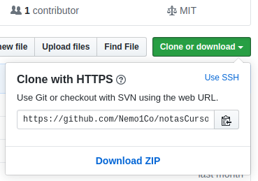
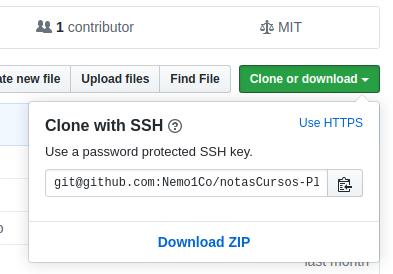

# Curso profesional de Git y GitHub

## _**Notas conjuntas curso versión 2017 y 2019 - Platzi**_

---

## Sistemas de Control de Versiones

Un control de versiones es un sistema que registra los cambios realizados en un archivo o conjunto de archivos a lo largo del tiempo, de modo que puedas recuperar versiones específicas más adelante.

Dicho sistema permite regresar a versiones anteriores de tus archivos, regresar a una versión anterior del proyecto completo, comparar cambios a lo largo del tiempo, ver quién modificó por última vez algo que pueda estar causando problemas, ver quién introdujo un problema y cuándo, y mucho más. Usar un VCS también significa generalmente que si arruinas o pierdes archivos, será posible recuperarlos fácilmente. Adicionalmente, obtendrás todos estos beneficios a un costo muy bajo.

Existen tres modos de mantener los repositorios:

1. Solo en Local
2. Centralizado
3. Distribuido

[Extraído de Git Book](https://git-scm.com/book/es/v2/Inicio---Sobre-el-Control-de-Versiones-Acerca-del-Control-de-Versiones)

## Una breve historia de Git

Como muchas de las grandes cosas en esta vida, Git comenzó con un poco de destrucción creativa y una gran polémica.

El kernel de Linux es un proyecto de software de código abierto con un alcance bastante amplio. Durante la mayor parte del mantenimiento del kernel de Linux (1991-2002), los cambios en el software se realizaban a través de parches y archivos. En el 2002, el proyecto del kernel de Linux empezó a usar un DVCS propietario llamado BitKeeper.

En el 2005, la relación entre la comunidad que desarrollaba el kernel de Linux y la compañía que desarrollaba BitKeeper se vino abajo y la herramienta dejó de ser ofrecida de manera gratuita. Esto impulsó a la comunidad de desarrollo de Linux (y en particular a Linus Torvalds, el creador de Linux) a desarrollar su propia herramienta basada en algunas de las lecciones que aprendieron mientras usaban BitKeeper. Algunos de los objetivos del nuevo sistema fueron los siguientes:

- Velocidad
- Diseño sencillo
- Gran soporte para desarrollo no lineal (miles de ramas paralelas)
- Completamente distribuido
- Capaz de manejar grandes proyectos (como el kernel de Linux) eficientemente (velocidad y tamaño de los datos)

Desde su nacimiento en el 2005, Git ha evolucionado y madurado para ser fácil de usar y conservar sus características iniciales. Es tremendamente rápido, muy eficiente con grandes proyectos y tiene un increíble sistema de ramificación (_branching_) para desarrollo no lineal.

---

---

## Introducción a la terminal y línea de comandos REVISAR

Diferencias entre la estructura de archivos de Windows, Mac o Linux.

La ruta principal en Windows es `C:\`, en UNIX es solo `/`. Windows no hace diferencia entre mayúsculas y minúsculas pero UNIX sí. Recuerda que GitBash usa la ruta `/c` para dirigirse a `C:\` (o `/d` para dirigirse a `D:\`) en Windows. Por lo tanto, la ruta del usuario con el que estás trabajando es `/c/Users/Nombre-del-Usuario`

Todos estos comandos tiene una función de autocompletado, o sea, puedes escribir la primera parte y presionar la tecla `Tab` para que la terminal nos muestre todas las posibles carpetas o comandos que podemos ejecutar. Si presionas la tecla Arriba puedes ver el último comando que ejecutamos.

Recuerda que podemos descubrir todos los argumentos de un comando con el argumento `--help` (por ejemplo, `cat --help`).

__Comandos básico en la terminal - _tipo Unix___

- __clear__: limpia la pantalla de la terminal. También se puede usar los atajos de teclado `Ctrl + l` o `Command + L`.
- __history__: Muestra el histórico de todos los comandos que hemos ejecutado. Para ejecutar un comando previo del historial existen dos formas básicas:
  1. Usar las fechas de navegación del teclado _arriba_ y _abajo_ para buscar comandos previos.
  2. Conociendo el número de ejecución en el archivo __history__, se ejecuta con un signo de admiración y el numero: __`!134`__

### Listar archivos

- __ls__: permite listar los archivos y directorios que se encuentren dentro de la carpeta en la que estamos ubicados, podemos pasar distintos parámetros a este comando, ejemplo `ls -la`:
  - __a__: ver los archivos ocultos.
  - __l__: lista los contenidos mostrando sus permisos y propiedades. Algunos comandos sólo operan acompañados, ej:
    - __lt__: lista los contenidos según su fecha de modificación.
    - __lh__: indica el tamaño del elemento en una presentación más "humana" - fácil.

### Navegar entre carpetas

- __pwd__: retorna la ruta absoluta en la cual nos encontramos.
- __cd__: nos permite navegar entre carpetas:
  - __cd .__: refiere a la carpeta en la cual se está ubicados.
  - __cd ..__: se refiere a la carpeta padre de la actual ubicación. Regresar una carpeta hacia atrás.
  - __cd__ o __cd ~__: se ubica en la carpeta home de la computadora
  - __cd sub-carpeta__: Navegar a una ruta dentro de la carpeta donde estamos ahora mismo.

### Creación, modificación y eliminación de archivos o carpetas

- __mkdir__: crea una carpeta con el nombre indicado, ej: `mkdir docsPlatzi`
- __touch__: crea un archivo vacío con el nombre que le indiquemos. Ej: `touch file.txt`
- __mv__: permite mover archivos entre distintas carpetas, se debe indicar el nombre del archivo y la ruta de destino.
- __rm__: elimina únicamente un archivo, añadiendo el parámetro `-rf` puede eliminar directorios también. Mucho cuidado con este comando, puedes borrar todo tu disco duro.
- __rmdir__: elimina directorios pero sólo si está vacío.
- __nano__ o __vim__: es un editor dentro de la consola, permite abrir cualquier archivo y modificarlo.

### Visualizar y abrir archivos en terminal

- __cat__: permite visualizar un archivo completo en la terminal (por ejemplo, `cat nombre-archivo.txt`).
  - para copiar: `cat file.txt > file-copy.txt`
- __more__ (en M.W. puede ser __less__): muestra por partes un archivo dentro de la terminal.
- __tail__: muestra las últimas 10 líneas de cada archivo, se puede modificar pasándo el parámetro con el número de líneas _-15_ y luego el archivo.
- __open__ (en M.W. puede ser __explorer__): abre un archivo con el programa que tengamos por defecto, puede o no ser de texto plano (fotos, videos, texto, etc.).

---

---

---

## [Instalación de Git](https://git-scm.com/book/es/v2/Inicio---Sobre-el-Control-de-Versiones-Instalaci%C3%B3n-de-Git)

Desde la propia página de GIT o revisando los videos del curso. Mas desde la página oficial de Git en español es rápido revisar.

```bash
$ git --version
git version 2.22.0.windows.1
```

## Configurando Git por primera vez

Git trae una herramienta llamada git config que te permite obtener y establecer variables de configuración, que controlan el aspecto y funcionamiento de Git. Se puede listar todas las variables de configuración con `git config --list` y con otro parámetro extra ej. `git config --list --show-origin` indicará la ruta local donde se almacena cada archivo de configuración por variable.

### Tu identidad

Lo primero que deberías hacer cuando instalas Git es establecer tu nombre de usuario y dirección de correo electrónico. Esto es importante porque las confirmaciones de cambios (_commits_) en Git usan esta información, y es introducida de manera inmutable en los _commits_ que envías:

```bash
git config --global user.name "John Doe"
git config --global user.email "johndoe@example.com"
```

De nuevo, sólo necesitas hacer esto una vez si especificas la opción `--global`, ya que Git siempre usará esta información para todo lo que hagas en ese sistema. Si quieres sobrescribir esta información con otro nombre o dirección de correo para proyectos específicos, puedes ejecutar el comando sin la opción `--global` cuando estés en ese proyecto.

### Tu editor

Ahora que tu identidad está configurada, puedes elegir el editor de texto por defecto que se utilizará cuando Git necesite que introduzcas un mensaje. Si no indicas nada, Git usa el editor por defecto de tu sistema, que generalmente es Vi o Vim. Si quieres usar otro editor de texto, como _Emacs_ o _VScode_, puedes hacer lo siguiente:

```bash
git config --global core.editor code
```

### Colores en Git

Git puede marcar con colores los resultados que muestra en tu terminal, ayudando así a leer más fácilmente. Hay unos cuantos parámetros que te pueden ayudar a configurar tus colores favoritos.

Si se lo pides, Git coloreará automáticamente la mayor parte de los resultados que muestre. Puedes ajustar con precisión cada una de las partes a colorear; pero si deseas activar de un golpe todos los colores por defecto, no tienes más que poner a "true" el parámetro 'color.ui'.

```bash
git config --global color.ui true
```

Ajustando así este parámetro, Git colorea sus resultados cuando estos se muestran en un terminal. Otros ajustes posibles son `false`, para indicar a Git no colorear nunca ninguno de sus resultados; y `always`, para indicar colorear siempre, incluso cuando se redirija la salida a un archivo o a otro comando.

Será muy raro ajustar `color.ui = always`. En la mayor parte de las ocasiones, cuando necesites códigos de color en los resultados, es mejor indicar puntualmente la opción `--color` en el comando concreto, para obligar a utilizar códigos de color. Habitualmente, se trabajará con el ajuste `color.ui = true`.

## [Fundamentos de Git](https://git-scm.com/book/es/v2/Inicio---Sobre-el-Control-de-Versiones-Fundamentos-de-Git)

Para iniciar un repositorio, o sea, activar el sistema de control de versiones de Git en tu proyecto, sólo debes ejecutar el comando `git init`.

Este comando se encargará de dos cosas: _**primero**_, crear una carpeta `.git` donde se guardará toda la base de datos con cambios atómicos de nuestro proyecto; y _**segundo**_, crear un área en la memoria RAM, que conocemos como _Staging_, que guardará temporalmente nuestros archivos (cuando ejecutemos un comando especial para eso) y nos permitirá, más adelante, guardar estos cambios en el repositorio (también con un comando especial).

**_Ciclo de vida o estados de los archivos en Git:_**

Cuando trabajamos con Git, nuestros archivos pueden vivir y moverse entre 4 diferentes estados (cuando trabajamos con repositorios remotos pueden ser más estados pero lo estudiaremos más adelante):

- __Archivos Untracked__: Son archivos que NO viven dentro de Git, sólo en el disco duro. Nunca han sido afectados por `git add`, así que Git no tiene registros de su existencia.
- __Archivos Tracked__: Son los archivos que viven dentro de Git, no tienen cambios pendientes y sus últimas actualizaciones han sido guardadas en el repositorio gracias a los comandos `git add` y `git commit`.
- __Archivos Unstaged__: Se entiende como archivos “_Tracked_ pero _Unstaged_”. Son archivos que viven dentro de Git pero no han sido afectados por el comando `git add` y mucho menos por `git commit`. Git tiene un registro de estos archivos pero está desactualizado, sus últimas versiones sólo están guardadas en el disco duro.
- __Archivos Staged__: Son archivos en _Staging_. Viven dentro de Git y hay registro de ellos porque han sido afectados por el comando `git add`, aunque no sus últimos cambios. Git ya sabe de la existencia de estos últimos cambios pero todavía no han sido guardados definitivamente en el repositorio porque falta ejecutar el comando `git commit`.

**NOTA**: Recuerda que hay un caso muy raro donde los archivos tienen dos estados al mismo tiempo: _Staged_ y _Untracked_. Esto pasa guardas los cambios de un archivo en el área de _Staging_ (con el comando `git add`) pero, antes de hacer _commit_ para guardar los cambios en el repositorio, haces nuevos cambios que todavía no han sido guardados en el área de _Staging_ (en realidad, todo sigue funcionando igual pero es un poco divertido).

---

---

---

## Git - Comandos iniciales

Cuando se ingresa desde git a una carpeta ya iniciada como repositorio, la terminal mostrará una marca ej: `(master)`, indicando la rama actual.

### Iniciar un repositorio

- En la carpeta actual se usa: **`git init`**
- En otra carpeta se agrega el directorio: **`git init Nuevo-Directorio`**

### Borrar repositorio manualmente

Para borrar un repositorio de forma manual sólo hace falta borrar la carpeta oculta _`.git`_ dentro la carpeta anfitrión del proyecto. O se puede visualmente con el navegador de archivos del sistema operativo.

```bash
rm -rf .git
```

### Cambiando archivos de estado en el repositorio

Estando dentro de un repositorio se puede usar el siguiente comando para conocer el estado de cada archivo:

```bash
git status
```

#### Archivos hacia el _Staging area_ y _Repository_

Con `add` se puede pasar archivos del _working directory_ al _staging area_.

```bash
git add file1.txt file.html file2.txt file1.css file2.css
```

Agrega todos los archivos del estado _working_ al _staging_

```bash
git add -A
```

Confirma si un archivo existe en el directorio

```bash
git add -n file.js
```

También es posible sacar un archivo del _staging_ y devolverlo al _working directory_

```bash
git rm --cached file.js
```

Aun, si lo que se quiere es eliminar en un solo paso un elemento por completo y ya fue agregado al _staging_, se puede aplicar el siguiente comando. Mucho cuidado con esto pues también elimina los elementos del directorio de trabajo.

```bash
git rm -f index.css
```

Para comprometer los archivos del _staging_ hacia el repositorio (_git directory_):

```bash
git commit -m "comentario sobre el commit realizado"
```

Si por alguna razón en el último _commit_ se olvido agregar un elemento o edición a un archivo, es posible agregar lo que falte al _staging_ para luego pedirle a git que realize una concatenación de lo nuevo con el _commit_ previo usando `--amend`

```bash
git commit --amend -m "comentario opcional que reemplaza el último realizado"
```

Existe una combinación que mejora la productividad al realizar un `git add` y `git commit -m` en un solo paso pero con un detalle.

Este comando realiza lo esperado pero sólo agrega al _staging_ los archivos que ya estaban en seguimiento previamente (_tracked_) y termina con el _commit_ correspondiente. Esto significa que cualquier archivo que no este siendo seguido (_untracked_) no será agregado al repositorio con el _commit_.

```bash
git commit -am "Este sería el comentario del commit"
```

---

---

## Historial de _commits_

Este comando sin más banderas por defecto presenta toda la historia de cada _commit_, donde cada uno muestra los siguientes detalles:

```git
git log
> commit: 124325455365745...2342342
> Author: Felipe Manter <felipe.manter@email.com>
> Date: Jueves agosto 29 22:43:30 2019
>    Mensaje del commit, si es que tiene. Es el comentario.
```

Dado que con el tiempo se agregan más y más _commits_, la gran cantidad de datos hará difícil leer el log. Existen opciones o configuraciones para mejorar la visualización según la necesidad. _**Es uno de los comandos más personalizables**_

### Ver solamente los 'n' _commits_ más recientes

```bash
# Muestra los tres más recientes
git log -3
```

### git log --stat

Muestra las diferencias históricas entre cada paso de _commit_ de manera resumida.

```bash
git log --stat
```

### git reflog

Muestra todo el historial de los _sha1_ y _HEAD_ con el comando ejecutado.

```bash
git reflog
```

### Opciones mejoradas de una sola línea

#### Versión acortada

```bash
git log --oneline
```

#### Versión acortada más gráfica de ramificación

```bash
git log --oneline --graph
```

#### Resumen de cada _commit_ decorado y gráfica del paso por rama

```bash
git log --all --oneline --graph --decorate
```

---

## git blame

Es un comando muy útil que permite ver quién modificó específicamente una o varias líneas.

```bash
git blame archivo_34.txt
```

Permite escoger un intervalo de líneas a revisar:

```bash
git blame -L35,53 style.scss
```

Similar al anterior pero agrega un poco más de formato

```bash
git blame -L12,20 -c index.html
```

---

---

## git diff

Sirve para revisar los cambios / diferencias entre dos _commits_, se le debe pasar el _sha1_ del _commit_ requerido.

Cuando solo se coloca un _sha1_ la comparación se realiza contra el _commit_ más reciente de la rama en la que se está.

```bash
git diff 45376ac765d45e58fa65ab95698bdc56
```

Ahora, si se comparan dos _commits_ distintos es importante el orden de cada uno de los _sha1_ correspondiente. Donde el primer argumento debería ser el del _commit_ más antiguo y el segundo el _sha1_ del _commit_ más reciente.

```bash
# git diff _sha1-antiguo_ _sha1-reciente_
git diff def34b14 aab345f1
```

---

---

## git reset

Existen tres tipos de _reset_ básicos que realizan tareas similares pero con diferencias importantes.

Para evitar grandes perdidas por un reset mal aplicado, se recomienda tener un _backup_ del `git log` o `git log --oneline`.

### reset --soft

El HEAD de la rama apuntará al _sha1_ indicado, en consecuencia cualquier _commit_ más reciente / nuevo a ese se "pierde".

```bash
git reset --soft _sha1_
```

### reset --mixed

Inicialmente realiza la misma operación del caso `--soft`. Seguidamente actualiza el área _index/staging_ con la instancia a la que apunta ahora el HEAD en el repositorio / _commit_.

```bash
git reset --mixed _sha1_
```

### reset --hard

De manera idéntica opera al `--mixed` para luego generar una la misma instancia del repositorio en el directorio de trabajo (_working directory_).

```bash
git reset --hard _sha1_
```

---

---

## Las Ramas en Git

**¿Por qué crear otra rama?** Esto es necesario cuando se requiere trabajar en una característica en partícular del proyecto y para noa afectar la rama principal (_la base_).

Con el siguiente comando se crea una rama independiente basada en el HEAD de la rama actual.

```bash
git branch miNuevaRama
```

### Listar ramas del repositorio

Luego de crear varias ramas, es muy útil poder listarlas. Donde con bandera se puede lograr:

- `-l` : Listar todas las ramas locales dentro del repositorio.
- `-r` : listar todas las ramas remotas del repositorio.
- `-a` : listar todas las ramas locales y remotas.

```bash
git branch -l

git branch -r

git branch -a
```

Git cuenta con una interfaz gráfica por defecto, que debe ser usada como herramienta auxiliar (recomendación de los expertos).

```bash
gitk
```

### Borrar y renombrar ramas locales

Para borrar una rama existen dos bandera que se pueden usar. `-d` indica eliminar la rama, pero en ocasiones el sistema git no lo permite y si aún se desea se debe forzar el borrado con `-D`.

```bash
git branch -d miNuevaRama

git branch -D miNuevaRama
```

### Cambiar a otra rama

Con `branch` sólo se crean nuevas ramas pero no se cambia de la rama actual a otra. Por este motivo se debe usar `checkout`.

```bash
> (master)

git checkout miRama2

> (miRama2)
```

Ahora, el flujo de trabajo indicaría que debemos usar primer crear la nueva rama `git branch nombreNuevaRama` y luego cambiar a ésta si se desea trabajar allí con `git checkout nombreNuevaRama`. En este caso Git combina en un solo paso estos dos procesos en uno solo, creando la rama nueva y moviéndose inmediatamente a ésta:

```bash
git checkout -b nombreNuevaRama
```

Estando en una rama específica también es posible navegar entre los _commits_ de esa ella. Donde crea una rama virtual y se mueve a ésta sin modificar el historial como lo hace `reset`.

```bash
git checkout _sha1_
```

### Fusión o mezcla de ramas

[Diferencias entre `merge` y `rebase`](https://medium.com/@MiguelCasas/diferencia-entre-git-rebase-y-git-merge-workshop-de-git-8622dedde2d7)

Si se requiere mezclar los cambios de un rama con otra rama, lo primero será cambiar a la rama que deseamos sea la principal (la base) para luego ejecutar:

```bash
git merge nombreRama2
```

De este modo, la rama secundaria (ej. _`nombreRama2`_) se fusiona sobre la primera en la que se está actualmente. No obstante, la rama secundaria (la fusionada) no desaparece; lo que realmente se hace es una "copia" de la rama dos y se fusiona con la rama uno.

Al caso anterior, existe un modo de fusión donde la mezcla hace que desaparezca la rama dos y reescribe de manera "brutal" el historial de la rama uno, el comando es `rebase`.

Es una buena practica en el caso del `rebase`: primero realizar el _rebase_ sobre la rama que va a desaparecer con una copia de la rama uno, luego que todo este bien, si se haría el _rebase_ sobre la rama requerida. Sólo usa `rebase` cuando sea extractamente necesario o tu equipo de trabajo te odiará.

---

## git stash

> **CUIDADO**: cuando se mueve entre ramas se heredan archivos modificados, los _untracked_ y los del _staging directory_. Entonces se debe tener cuidado de cambiar de rama cuando existen archivos en el _staging area_ sin _commits_.

Para solventar el problema de heredar archivos del _staging area_ si no es posible revertir los cambios o hacer un _commit_ antes de cambiar de rama, existe `stash`.

**Resumen: `stach`** es un estado intermedio, donde guardaremos el estado actual del _working directory_ y del _staging directory_ sin tener que realizar un _commit_ forzado antes de cambiar de rama.

Según se está trabajando en un apartado de un proyecto, normalmente el espacio de trabajo suele estar en un estado inconsistente. Pero puede que se necesite cambiar de rama durante un breve tiempo para ponerse a trabajar en algún otro tema urgente. Esto plantea el problema de confirmar cambios en un trabajo medio hecho, simplemente para poder volver a ese punto más tarde. Y su solución es el comando `git stash`.

Este comando de guardado rápido (_stashing_) toma el estado del espacio de trabajo, con todas las modificaciones en los archivos bajo control de cambios, y lo guarda en una pila provisional. Desde allí, se podrán recuperar posteriormente y volverlas a aplicar de nuevo sobre el espacio de trabajo.

### Lo básico de Crear, aplicar y borrar con _`stash`_

```bash
git stash

# On branch master
# Changes to be committed:
#   (use "git reset HEAD <file>..." to unstage)
#
#      modified:   index.html
#
# Changes not staged for commit:
#   (use "git add <file>..." to update what will be committed)
#
#      modified:   lib/simplegit.rb
```

Aplica el último _stash_ apilado. La pila de _stash_ es de **tipo LIFO** (del inglés _Last In, First Out_, «último en entrar, primero en salir»)

```bash
git stash apply

# On branch master
# Changes not staged for commit:
#   (use "git add <file>..." to update what will be committed)
#
#      modified:   index.html
#      modified:   lib/simplegit.rb
```

Como se ve en la salida del comando, Git vuelve a aplicar los correspondientes cambios en los archivos que estaban modificados. Pero no conserva la información de lo que estaba o no estaba añadido al área de preparación. En este ejemplo se han aplicado los cambios de vuelta sobre un espacio de trabajo limpio, en la misma rama. Pero no es esta la única situación en la que se pueden re-aplicar cambios. Es perfectamente posible guardar rápidamente (stash) el estado de una rama. Cambiar posteriormente a otra rama. Y proceder a aplicar sobre esta otra rama los cambios guardados, en lugar de sobre la rama original. Es posible incluso aplicar de vuelta cambios sobre un espacio de trabajo inconsistente, donde haya otros cambios o algunos archivos añadidos al área de preparación. (Git notificará de los correspondientes conflictos de fusión si todo ello no se puede aplicar limpiamente.)

Las modificaciones sobre los archivos serán aplicadas; pero no así el estado de preparación. Para conseguir esto último, es necesario emplear la opción `--index` del comando `git stash apply`. Con ella se le indica que debe intentar re-aplicar también el estado de preparación de los archivos. Y asi se puede conseguir volver exactamente al punto original:

```bash
git stash apply --index

# On branch master
# Changes to be committed:
#   (use "git reset HEAD <file>..." to unstage)
#
#      modified:   index.html
#
# Changes not staged for commit:
#   (use "git add <file>..." to update what will be committed)
#
#      modified:   lib/simplegit.rb
```

Ahora, si se desea aplicar un conjunto de cambios anteriores al más reciente  guardado se debe especificar así:

```bash
git stash apply stash@{2}
```

Para listar los _stash_ guardados se usa:

```bash
git stash list
> stash@{0}: WIP on master: 049d078 added the index file
> stash@{1}: WIP on master: c264051... Revert "added file_size"
> stash@{2}: WIP on master: 21d80a5... added number to log
```

Los comandos `git stash apply` tan solo recuperan cambios almacenados en la pila de guardado rápido, sin afectar al estado de la pila. Es decir, los cambios siguen estando guardados en la pila. Para quitarlos de ahí, es necesario lanzar expresamente el comando e indicar el número de guardado a borrar de la pila:

```bash
$ git stash drop stash@{0}
Dropped stash@{0} (364e91f3f268f0900bc3ee613f9f733e82aaed43)
```

### Modos auxiliares interesantes de _`stash`_

#### Aplicar y eliminar conjunto de cambios en un comando

También es posible utilizar un comando que aplica cambios de un guardado y lo retira inmediatamente de la pila.

```bash
git stash pop
```

#### Creando una rama desde un guardado rápido temporal

Si se almacena rápidamente un cierto trabajo, se deja en la pila durante bastante tiempo, y se continua mientras tanto con otros trabajos sobre la misma rama. Es muy posible que se presenten problemas al tratar de re-aplicar los cambios guardados tiempo atrás. Si para recuperar esos cambios se ha de modificar un archivo que también haya sido modificado en los trabajos posteriores, se dará un conflicto de fusión (_merge conflict_) y será preciso resolverlo manualmente. Una forma más sencilla de re-aplicar cambios es utilizando el comando `git stash branch`. Este comando crea una nueva rama, extrayendo la confirmación de cambios original en la que se estaba cuando los cambios fueron guardados en la pila, reaplica estos sobre dicha rama y los borra de la pila si se consigue completar el proceso con éxito.

```bash
git stash branch testchanges

> Switched to a new branch "testchanges"
# On branch testchanges
# Changes to be committed:
#   (use "git reset HEAD <file>..." to unstage)
#
#      modified:   index.html
#
# Changes not staged for commit:
#   (use "git add <file>..." to update what will be committed)
#
#      modified:   lib/simplegit.rb
#
Dropped refs/stash@{0} (f0dfc4d5dc332d1cee34a634182e168c4efc3359)
```

Este es un buen atajo para recuperar con facilidad un cierto trabajo desde la pila y continuar con él en una nueva rama.

Tomado de [Guardado rápido provisional - Git](https://git-scm.com/book/es/v1/Las-herramientas-de-Git-Guardado-r%C3%A1pido-provisional).

---

---

## Etiqueta hitos en un proyecto _`git tag`_

Tomado de [Creando etiquetas](https://git-scm.com/book/es/v1/Fundamentos-de-Git-Creando-etiquetas)

Como muchos VCSs, Git tiene la habilidad de etiquetar (tag) puntos específicos en la historia como importantes. Generalmente la gente usa esta funcionalidad para marcar puntos donde se ha lanzado alguna versión (v1.0, y así sucesivamente). En esta sección aprenderás cómo listar las etiquetas disponibles, crear nuevas etiquetas y qué tipos diferentes de etiquetas hay.

### Listando tus etiquetas

Listar las etiquetas disponibles en Git es sencillo, Simplemente escribe `git tag`:

```bash
git tag

v0.1
v1.3
```

Este comando lista las etiquetas en orden alfabético; el orden en el que aparecen no es realmente importante.

También puedes buscar etiquetas de acuerdo a un patrón en particular. El repositorio fuente de Git, por ejemplo, contiene mas de 240 etiquetas. Si solo estás interesado en la serie 1.4.2, puedes ejecutar esto:

```bash
git tag -l 'v1.4.2.*'

v1.4.2.1
v1.4.2.2
v1.4.2.3
v1.4.2.4
```

### Creando etiquetas

Git usa dos tipos principales de etiquetas: ligeras y anotadas. Una etiqueta ligera es muy parecida a una rama que no cambia —un puntero a una confirmación específica—. Sin embargo, las etiquetas anotadas son almacenadas como objetos completos en la base de datos de Git. Tienen suma de comprobación; contienen el nombre del responsable, correo electrónico y fecha; tienen mensaje de etiquetado; y pueden estar firmadas y verificadas con GNU Privacy Guard (GPG). Generalmente se recomienda crear etiquetas anotadas para disponer de toda esta información; pero si por alguna razón quieres una etiqueta temporal y no quieres almacenar el resto de información, también tiene disponibles las etiquetas ligeras.

#### Etiquetas anotadas

Crear una etiqueta anotada en Git es simple. La forma más fácil es especificar `-a` al ejecutar el comando _tag_:

```bash
git tag -a v1.4 -m 'my version 1.4'
git tag

v0.1
v1.3
v1.4
```

El parámetro `-m` especifica el mensaje, el cual se almacena con la etiqueta. Si no se especifica un mensaje para la etiqueta anotada, Git lanza tu editor para poder escribirlo.

Puedes ver los datos de la etiqueta junto con la confirmación que fue etiquetada usando el comando `git show`:

```bash
git show v1.4

tag v1.4
Tagger: Scott Chacon <lee@gee-mail.com>
Date:   Mon Feb 9 14:45:11 2009 -0800

my version 1.4
commit 15027957951b64cf874c3557a0f3547bd83b3ff6
Merge: 4a447f7... a6b4c97...
Author: Scott Chacon <lee@gee-mail.com>
Date:   Sun Feb 8 19:02:46 2009 -0800

  Merge branch 'experiment'
```

Esto muestra la información del autor de la etiqueta, la fecha en la que la confirmación fue etiquetada, y el mensaje de anotación antes de mostrar la información de la confirmación.

#### Etiquetas ligeras

Otra forma de etiquetar confirmaciones es con una etiqueta ligera. Esto es básicamente la suma de comprobación de la confirmación almacenada en un archivo «ninguna otra información es guardada». Para crear una etiqueta ligera no añadas las opciones `-a`, `-s` o `-m`:

```bash
git tag v1.4-lw
git tag

v0.1
v1.3
v1.4
v1.4-lw
v1.5
```

Esta vez, si ejecutas el comando `git show` en la etiqueta, no verás ninguna información extra. El comando simplemente muestra la confirmación.

```bash
git show v1.4-lw

commit 15027957951b64cf874c3557a0f3547bd83b3ff6
Merge: 4a447f7... a6b4c97...
Author: Scott Chacon <lee@gee-mail.com>
Date:   Sun Feb 8 19:02:46 2009 -0800

  Merge branch 'experiment'
```

#### Etiquetando más tarde

Puedes incluso etiquetar confirmaciones después de avanzar sobre ellas. Supongamos un histórico de confirmaciones que se parece a esto:

```bash
git log --pretty=oneline

15027957951b64cf874c3557a0f3547bd83b3ff6 Merge branch 'experiment'
a6b4c97498bd301d84096da251c98a07c7723e65 beginning write support
0d52aaab4479697da7686c15f77a3d64d9165190 one more thing
6d52a271eda8725415634dd79daabbc4d9b6008e Merge branch 'experiment'
0b7434d86859cc7b8c3d5e1dddfed66ff742fcbc added a commit function
4682c3261057305bdd616e23b64b0857d832627b added a todo file
166ae0c4d3f420721acbb115cc33848dfcc2121a started write support
9fceb02d0ae598e95dc970b74767f19372d61af8 updated rakefile
964f16d36dfccde844893cac5b347e7b3d44abbc commit the todo
8a5cbc430f1a9c3d00faaeffd07798508422908a updated readme
```

Ahora, digamos que se olvido etiquetar el proyecto en _v1.2_, que estaba en la confirmación _"updated rakefile"_. Puedes hacerlo ahora. Para etiquetar esa confirmación especifica la suma de comprobación de la confirmación (o una parte de la misma) al final del comando:

```bash
git tag -a v1.2 -m 'version 1.2' 9fceb02
```

Se puede confirmar:

```bash
git tag

v0.1
v1.2
v1.3
v1.4
v1.4-lw
v1.5
```

```bash
git show v1.2

tag v1.2
Tagger: Scott Chacon <lee@gee-mail.com>
Date:   Mon Feb 9 15:32:16 2009 -0800

version 1.2
commit 9fceb02d0ae598e95dc970b74767f19372d61af8
Author: Magnus Chacon <any@gee-mail.com>
Date:   Sun Apr 27 20:43:35 2008 -0700

    updated rakefile
```

#### Borrar un _tag_

Para borrar un _tag_ en el repositorio local, solo se ejecuta el comando `tag` con la bandera `-d` seguido de la etiqueta creada, ejemplo `v1.2.5`:

```bash
git tag -d v1.2.5
```

#### Aplicando _commits_ específicos en otra rama [cherry-pick](https://www.runroom.com/realworld/seleccionando-commits-cherry-pick)

---

---

---

## git clean

Borra archivos del directorio de trabajo que no estén en seguimiento (_tracked_)

```bash
git clean
```

Con `--dry-run` git simula que archivos serán borrados y con `-f` fuerza el borrado dicho (tampoco borra archivos ignorados y ya _tracked_).

```bash
git clean --dry-run
> file20 file13 ...

git clean -f
# borra -> file20 file13 ...
```

Agregando `d` al parámetro de borrado forzado, se le permite borrar directorios.

```bash
git clean -df
```

---

## Buscar palabras

### En los archivos del proyecto

`git grep _word_`: donde _word_ es la palabra a buscar, si es una etiqueta ejemplo de html se debe colocar entre comillas "\<p>"

```bash
git grep "<p>"
git grep red
```

Muestra el número de línea donde está

```bash
git grep -n red
```

Entrega el conteo de esa palabra en los archivos

```bash
git grep -c "<p>"
```

### En el historial de _commits_

En mayúsculas la "S" y la palabra entre comillas:

```bash
git log -S "sass"
```

---

---

## Alias para comandos de Git

### Del mundo GNU/Linux

```bash
alias miComandoLog = "git log --all --graph --decorate --oneline"
```

### Directamente con Git

El parámetro global se puede retirar, así solamente sería un alias para el repositorio actual.

```bash
git config --global alias.miComandoLog "git log --all --graph --decorate --oneline"
```

---

## Ignorar archivos del _working directory_ para el repositorio

Para evitar que algunos archivos no deseados estén en seguimiento y por lo tanto se les realice un versionado, se usa un archivo en la carpeta raíz del proyecto llamado _.gitignore_ (con el punto inicial de oculto).

En este archivo se indicará todos los tipos de archivos que se desean ignorar para el VCS de git.

---

---

---

---

## GitHub

Cuando se cuenta con un repositorio remoto (Interno, GitHub, GitLab, etc.) el flujo de trabajo será muy similar. En este caso veremos Git & GitHub.

### Flujo de trabajo esperado

Agregar _commits_ y luego empujar los cambios al servidor remoto. El flujo anterior obedecé al caso cuando ya he conectado ambas repositorios local / remoto y nos dedicamos a mantenerlo actualizado.

```bash
git add .

git commit -m "Primer commit"

git push
```

### Conectarse con GitHub

Existen dos modos de conectarse desde el repositorio local con GitHub:

- HTTPS
- SSH

#### HTTPS

En GitHub el modo más simple es usando conexión HTTPS. Donde sólo pide el usuario y contraseña de la cuenta de GitHub y ya estaría listo para trabajar.



```bash
# Para un repo local que ya existe
git remote add _url-HTTPS_
```

```bash
# Clona el repo remoto desde ceros
git clone _url-HTTPS_
git pull
```

#### SSH

El segundo método no es tan simple como el primero, pero es mejor en cuanto a la seguridad de la conexión.

1. **Generar las llaves SSH**: tener una llave SSH permite una conexión fácil y segura con servidores. Para crear una llave SSH utilizamos el siguiente comando.
   - **`ssh-keygen -t rsa -b 4096 -C "comentario para recordar el pasado"`**
     - _`ssh-keygen`_: comando para crear llaves ssh
     - _`-t rsa`_: donde `-t` es el parámetro para usar un tipo de algoritmo especifico. En este caso es el algoritmo `rsa`, en nombre de sus creadores Rivest, Shamir y Adelman.
     - _`-b 4096`_: y `-b` que indica la cantidad de bits de la llave. Con 2048 podría ser suficiente pero con el doble es mejor y tampoco es excesivo.
     - _`-C "comentario ..."`_: finalmente `-C` para darle un comentario a la llave.
     - 
2. **Terminar de configurar el sistema**: En este momento sólo se ha pedido la creación de las llaves correspondientes, y lo más probable es que el comando nos pregunte si deseamos usar la ruta por defecto para guardar los archivos. Se generan dos archivos, la llave privada y la pública que es el archivo con extensión `.pub`. Es probable que haga falta:
   - Iniciar el agente generador de llaves con: **`eval $(ssh-agent)`**
   - Agregar la llave generada al servidor ssh iniciado con: **`ssh-add /YourDirLocalPrivateKey`**
   - Ver el contenido de la llave pública para copiar y pegar en el servidor: `cat id_rsa.pub`
3. **Entregar la llave publica local a GitHub**
   - Copiar el contenido de la llave publica local.
   - Entrar a la configuración de llaves SSH en GitHub.
   - Crear una nueva llave SSH en GitHub con el contenido copiado.
   - _**EXTRA**_: Ahora si ya tenemos el repositorio local previamente vinculado por HTTPS se debe cambiar al SSH con el link SSH dado por GitHub y ejecutar:
     - **`git remote set-url _url-SSH-de-GitHub_`**

```bash
# Para un repo local que ya existe
git remote add _url-SSH_
```

```bash
# Clona el repo remoto desde ceros
git clone _url-SSH_
git pull
```

### El inicio de vincular un repositorio local al remoto

Cuando creas un repositorio remoto en GitHub y en local has iniciado con `git init`, entonces se genera un error de historias diferentes entre ambos repositorios (local y remoto). Veamos el caso desde la inclusión del repositorio remoto y la solución a este inconveniente.

Agregar la referencia al repo remoto se realiza con el comando `remote` la bandera `add` seguido del nombre del repositorio local, que para efectos prácticos suelen llamarlo `origin`, y finalmente la dirección url del repo remoto.

```bash
git remote add origin _URL_
```

Ahora, si se hiciera `git push origin master` lo más seguro es que rechaze la actualización pues son proyectos distintos y no vínculados aún.

Es entonces cuando el sistema indica la necesidad de traer los cambios del remoto al local con `git pull`. No obstante, la primera vez Git se reusará a la mezcla de los _commits_ pues aún las historias son distintas.

```bash
git pull origin master
```

Para solventar dicho inconveniente se ejecuta el siguiente comando que traerá los cambios del remoto a la rama local.

```bash
git pull origin master --allow-unrelated-histories
```

Se verifica si la url se guardo.

```bash
git remote -v
```

Es entonces, cuando ya es posible enviar los nuevos cambios del repositorio local al remoto.

```bash
git push origin master
```

### Buena practica `fetch` y `merge`

Es una practica recomendada en vez de usar `git pull`, usar su trabajo por separado con:

1. `git fetch upST`
   - Trae la actualización del repositorio remoto al vínculo del local/remoto.
2. `git merge upST/master`
   - Para aplicar los cambios al repositorio local.

---

---

### Comandos hasta ahora para operar con GitHub

Fuera de los comandos habituales:

- `git clone ...`
- `git merge ...`
- `git remote add ...`
- `git remote -v ...`
- `git pull ...`
  - `git fetch ...`
  - `git merge ...`
- `git push ...`

Existen muchas cosas más que conocer, pero definitivamente hay algunas rápidas que deberías conocer ahora para iniciar en este mundo "mágico"  :sparkles:  :tophat:  :tada:

---

### Ramas Remotas

Copia de [Ramificaciones en Git - Ramas Remotas
](https://git-scm.com/book/es/v1/Ramificaciones-en-Git-Ramas-Remotas)

Las ramas remotas son referencias al estado de ramas en tus repositorios remotos. Son ramas locales que no puedes mover; se mueven automáticamente cuando estableces comunicaciones en la red. Las ramas remotas funcionan como marcadores, para recordarte en qué estado se encontraban tus repositorios remotos la última vez que conectaste con ellos.

Suelen ser referencias como `(remoto)/(rama)`. Por ejemplo, si quieres saber cómo estaba la rama `master` en el remoto `origin`. Puedes revisar la rama `origin/master`. O si estás trabajando en un problema con un compañero y este envía (_push_) una rama `iss53`, tu tendrás tu propia rama de trabajo local `iss53`; pero la rama en el servidor apuntará a la última confirmación (_commit_) en la rama `origin/iss53`.

Esto puede ser un tanto confuso, pero intentemos aclararlo con un ejemplo. Supongamos que tienes un servidor Git en tu red, en _git.ourcompany.com_. Si haces un clón desde ahí, Git automáticamente lo denominará `origin`, traerá (`pull`) sus datos, creará un apuntador hacia donde esté en ese momento su rama `master`, denominará la copia local `origin/master`; y será inamovible para ti. Git te proporcionará también tu propia rama `master`, apuntando al mismo lugar que la rama `master` de `origin`; siendo en esta última donde podrás trabajar.

>
>
>_Fig 1. git-ramaRemota_: Un clón Git te proporciona tu propia rama master y otra rama `origin/master` apuntando a la rama `master` original.

Si haces algún trabajo en tu rama `master` local, y al mismo tiempo, alguna otra persona lleva (`push`) su trabajo al servidor _git.ourcompany.com_, actualizando la rama `master` de allí, te encontrarás con que ambos registros avanzan de forma diferente. Además, mientras no tengas contacto con el servidor, tu apuntador a tu rama `origin/master` no se moverá (Fig 2. git-ramaRemota).

>
>
>_Fig 2. git-ramaRemota_: Trabajando localmente y que otra persona esté llevando (`push`) algo al servidor remoto, hace que cada registro avance de forma distinta.

Para sincronizarte, puedes utilizar el comando `git fetch origin`. Este comando localiza en qué servidor está el origen (en este caso _git.ourcompany.com_), recupera cualquier dato presente allí que tu no tengas, y actualiza tu base de datos local, moviendo tu rama `origin/master` para que apunte a esta nueva y más reciente posición (ver Figura 3. git-ramaRemota).

>
>
>_Figura 3. git-ramaRemota_: El comando `git fetch` actualiza tus referencias remotas.

Para ilustrar mejor el caso de tener múltiples servidores y cómo van las ramas remotas para esos proyectos remotos. Supongamos que tienes otro servidor Git; utilizado solamente para desarrollo, por uno de tus equipos _sprint_. Un servidor en _git.team1.ourcompany.com_. Puedes incluirlo como una nueva referencia remota a tu proyecto actual, mediante el comando `git remote add`, tal y como vimos en el capítulo 2. Puedes denominar `teamone` a este remoto, poniendo este nombre abreviado para la URL (ver Figura 4. git-ramaRemota)

>
>
>_Figura 4. git-ramaRemota_: Añadiendo otro servidor como remoto.

Ahora, puedes usar el comando `git fetch teamone` para recuperar todo el contenido del servidor que tu no tenias. Debido a que dicho servidor es un subconjunto de de los datos del servidor `origin` que tienes actualmente, Git no recupera (`fetch`) ningún dato; simplemente prepara una rama remota llamada `teamone/master` para apuntar a la confirmación (`commit`) que `teamone` tiene en su rama `master`.

>
>
>_Figura 5. git-ramaRemota_: Obtienes una referencia local a la posición en la rama `master` de `teamone`.

#### Publicando

Cuando quieres compartir una rama con el resto del mundo, has de llevarla (push) a un remoto donde tengas permisos de escritura. Tus ramas locales no se sincronizan automáticamente con los remotos en los que escribes. Sino que tienes que llevar (push) expresamente, cada vez, al remoto las ramas que desees compartir. De esta forma, puedes usar ramas privadas para el trabajo que no deseas compartir. Llevando a un remoto tan solo aquellas partes que deseas aportar a los demás.

Si tienes una rama llamada `serverfix`, con la que vas a trabajar en colaboración; puedes llevarla al remoto de la misma forma que llevaste tu primera rama. Con el comando `git push (remoto) (rama)`:

```bash
git push origin serverfix

# Counting objects: 20, done.
# Compressing objects: 100% (14/14), done.
# Writing objects: 100% (15/15), 1.74 KiB, done.
# Total 15 (delta 5), reused 0 (delta 0)
# To git@github.com:lee/simplegit.git
#   * [new branch]      serverfix -> serverfix
```

Esto es un poco como un atajo. Git expande automáticamente el nombre de rama serverfix a `refs/heads/serverfix:refs/heads/serverfix`, que significa: "coge mi rama local `serverfix` y actualiza con ella la rama `serverfix` del remoto". Volveremos más tarde sobre el tema de `refs/heads/`, viéndolo en detalle en el capítulo 9; aunque puedes ignorarlo por ahora. También puedes hacer `git push origin serverfix:serverfix`, que hace lo mismo; es decir: "coge mi `serverfix` y hazlo el `serverfix` remoto".

Puedes utilizar este último formato para llevar una rama local a una rama remota con otro nombre distinto. Si no quieres que se llame `serverfix` en el remoto, puedes lanzar, por ejemplo, `git push origin serverfix:awesomebranch`; para llevar tu rama `serverfix` local a la rama `awesomebranch` en el proyecto remoto.

La próxima vez que tus colaboradores recuperen desde el servidor, obtendrán bajo la rama remota `origin/serverfix` una referencia a donde esté la versión de `serverfix` en el servidor:

```bash
git fetch origin

# remote: Counting objects: 20, done.
# remote: Compressing objects: 100% (14/14), done.
# remote: Total 15 (delta 5), reused 0 (delta 0)
# Unpacking objects: 100% (15/15), done.
# From git@github.com:lee/simplegit
#   * [new branch]      serverfix    -> origin/serverfix
```

Es importante destacar que cuando recuperas (`fetch`) nuevas ramas remotas, no obtienes automáticamente una copia editable local de las mismas. En otras palabras, en este caso, no tienes una nueva rama `serverfix`. Sino que únicamente tienes un puntero no editable a `origin/serverfix`.

Para integrar (`merge`) esto en tu actual rama de trabajo, puedes usar el comando `git merge origin/serverfix`. Y si quieres tener tu propia rama `serverfix`, donde puedas trabajar, puedes crearla directamente basándote en rama remota:

```bash
git checkout -b serverfix origin/serverfix

# Branch serverfix set up to track remote branch refs/remotes/origin/serverfix.
# Switched to a new branch "serverfix"Switched to a new branch "serverfix"
```

Esto sí te da una rama local donde puedes trabajar, comenzando donde `origin/serverfix` estaba en ese momento.

#### Haciendo seguimiento a las ramas

Activando (`checkout`) una rama local a partir de una rama remota, se crea automáticamente lo que podríamos denominar "una rama de seguimiento" (_tracking branch_). Las ramas de seguimiento son ramas locales que tienen una relación directa con alguna rama remota. Si estás en una rama de seguimiento y tecleas el comando `git push`, Git sabe automáticamente a qué servidor y a qué rama ha de llevar los contenidos. Igualmente, tecleando `git pull` mientras estamos en una de esas ramas, recupera (`fetch`) todas las referencias remotas y las consolida (`merge`) automáticamente en la correspondiente rama remota.

Cuando clonas un repositorio, este suele crear automáticamente una rama `master` que hace seguimiento de `origin/master`. Y es por eso que `git push` y `git pull` trabajan directamente, sin necesidad de más argumentos. Sin embargo, puedes preparar otras ramas de seguimiento si deseas tener unas que no hagan seguimiento de ramas en `origin` y que no sigan a la rama `master`. El ejemplo más simple, es el que acabas de ver al lanzar el comando `git checkout -b [rama] [nombreremoto]/[rama]`. Si tienes la versión 1.6.2 de Git, o superior, puedes utilizar también el parámetro `--track`:

```bash
git checkout --track origin/serverfix

# Branch serverfix set up to track remote branch refs/remotes/origin/serverfix.
# Switched to a new branch "serverfix"Switched to a new branch "serverfix"
```

Para preparar una rama local con un nombre distinto a la del remoto, puedes utilizar:

```bash
git checkout -b sf origin/serverfix

# Branch sf set up to track remote branch refs/remotes/origin/serverfix.
Switched to a new branch "sf"
```

Así, tu rama local `sf` va a llevar (`push`) y traer (`pull`) hacia o desde `origin/serverfix`.

#### Borrando ramas remotas

Imagina que ya has terminado con una rama remota. Es decir, tanto tú como tus colaboradores habéis completado una determinada funcionalidad y la habéis incorporado (`merge`) a la rama `master` en el remoto (o donde quiera que tengais la rama de código estable). Puedes borrar la rama remota utilizando la un tanto confusa sintaxis: `git push [nombreremoto] :[rama]`. Por ejemplo, si quieres borrar la rama `serverfix` del servidor, puedes utilizar:

```bash
git push origin :serverfix

# To git@github.com:lee/simplegit.git
#  - [deleted]         serverfix
```

Y... ¡Boom!. La rama en el servidor ha desaparecido. Puedes grabarte a fuego esta página, porque necesitarás ese comando y, lo más probable es que hayas olvidado su sintaxis. Una manera de recordar este comando es dándonos cuenta de que proviene de la sintaxis git push [nombreremoto] [ramalocal]:[ramaremota]. Si omites la parte `[ramalocal]`, lo que estás diciendo es:"no cojas nada de mi lado y haz con ello `[ramaremota]`".

---

### Etiquetas Remotas

Para ver las etiquetas en un historial de _commits_:

```bash
git show-ref --tags
```

Por defecto, el comando `git push` no transfiere etiquetas a servidores remotos. Tienes que enviarlas explicitamente a un servidor compartido después de haberlas creado. Este proceso es igual a compartir ramas remotas, puedes ejecutar `git push origin [tagname]`.

```bash
git push origin v1.5

Counting objects: 50, done.
Compressing objects: 100% (38/38), done.
Writing objects: 100% (44/44), 4.56 KiB, done.
Total 44 (delta 18), reused 8 (delta 1)
To git@github.com:lee/simplegit.git
* [new tag]         v1.5 -> v1.5
```

Si tienes un montón de etiquetas que quieres enviar a la vez, también puedes usar la opción `--tags` en el comando `git push`. Esto transfiere todas tus etiquetas que no estén ya en el servidor remoto.

```bash
git push origin --tags

Counting objects: 50, done.
Compressing objects: 100% (38/38), done.
Writing objects: 100% (44/44), 4.56 KiB, done.
Total 44 (delta 18), reused 8 (delta 1)
To git@github.com:lee/simplegit.git
  * [new tag]         v0.1 -> v0.1
  * [new tag]         v1.2 -> v1.2
  * [new tag]         v1.4 -> v1.4
  * [new tag]         v1.4-lw -> v1.4-lw
  * [new tag]         v1.5 -> v1.5
```

Ahora, cuando alguien clone o reciba de tu repositorio, obtendrá también todas tus etiquetas.

Borrar un _tag_ en GitHub desde consola. Para retirar o borrar la referencia de una etiqueta en el repositorio remoto conectada a un _tag_ local que se ha borrado.

```bash
git push :refs/tags/nameTag
```
